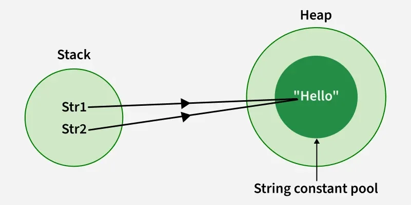

# **Java Interview Questions**

This document serves as a comprehensive guide for Java interview preparation, covering fundamental to advanced topics with structured explanations.

---

# Core Java

## Table of Contents

1. [What is JVM, JRE, and JDK?](#1-what-is-jvm-jre-and-jdk)
2. [What are the main features of Java?](#2-what-are-the-main-features-of-java)
3. [What is the difference between OOP and SOP?](#3-what-is-the-difference-between-oop-and-sop)
4. [Why is Java not a pure object-oriented language?](#4-why-is-java-not-a-pure-object-oriented-language)
5. [What is a classloader and what are its types?](#5-what-is-a-classloader-and-what-are-its-types)
6. [What is the difference between an Instance variable and a Local variable?](#6-what-is-the-difference-between-an-instance-variable-and-a-local-variable)
7. [What are memory allocations available in Java?](#7-what-are-memory-allocations-available-in-java)
8. [Why are Java Strings immutable?](#8-why-are-java-strings-immutable)
9. [What is the difference between String, StringBuffer, and StringBuilder?](#9-what-is-the-difference-between-string-stringbuffer-and-stringbuilder)
10. [What is Garbage Collection in Java and how does it work?](#10-what-is-garbage-collection-in-java-and-how-does-it-work)
11. [What is Garbage Collection in Java and how does it work?](#11-what-is-garbage-collection-in-java-and-how-does-it-work)
12. [What are Checked and Unchecked Exceptions in Java?](#12-what-are-checked-and-unchecked-exceptions-in-java)
13. [What are Checked and Unchecked Exceptions in Java?](#12-what-are-checked-and-unchecked-exceptions-in-java)
14. [What are Checked and Unchecked Exceptions in Java?](#12-what-are-checked-and-unchecked-exceptions-in-java)
15. [What are Checked and Unchecked Exceptions in Java?](#12-what-are-checked-and-unchecked-exceptions-in-java)
16. [What are Checked and Unchecked Exceptions in Java?](#12-what-are-checked-and-unchecked-exceptions-in-java)
17. [What are Checked and Unchecked Exceptions in Java?](#12-what-are-checked-and-unchecked-exceptions-in-java)
18. [What are Checked and Unchecked Exceptions in Java?](#12-what-are-checked-and-unchecked-exceptions-in-java)

---

## Questions and Answers

### 1. What is JVM, JRE, and JDK?

- **JVM (Java Virtual Machine):** It is a machine that provides the runtime environment in which Java bytecode can be executed. JVM is platform-dependent (different for Windows, Mac, Linux), but it is what makes Java bytecode platform-independent.
- **JRE (Java Runtime Environment):** It is a software package that provides the minimum requirements for executing a Java application. It contains the JVM, core libraries, and other supporting files. It does not contain development tools like compilers or debuggers.
- **JDK (Java Development Kit):** It is a full-featured software development kit required to develop and execute Java applications. It contains everything that JRE has, plus development tools such as the Java compiler (`javac`), debugger, and javadoc tool.

**Relationship:** `JDK = JRE + JVM`.

---

### 2. What are the main features of Java?

- **Simple:** Easy to learn, and its syntax is clean and concise.
- **Object-Oriented:** Everything in Java is an Object (except primitive types), following concepts like Inheritance, Polymorphism, Abstraction, and Encapsulation, Interfaces.
- **Platform Independent:** Follows the "Write Once, Run Anywhere" philosophy. Code is compiled into bytecode, which runs on any machine with a JVM.
- **Secure:** Java runs inside a virtual machine sandbox, no explicit pointers, and offers automated memory management.
- **Robust:** Emphasizes early checking for possible errors, with strong compile-time and runtime error-checking, plus a robust Exception Handling framework.
- **Multithreaded:** Java has built-in support for writing programs that can perform many tasks concurrently.

---

### 4. Why is Java not a pure object-oriented language?

Java is not considered a pure object-oriented language because it supports **primitive data types** (such as `int`, `char`, `float`, `double`, `boolean`, etc.) which are not objects. In a pure object-oriented language, everything must be an object. While Java provides wrapper classes (`Integer`, `Character`, etc.) and autoboxing, the baseline existence of primitives prevents it from being 100% pure.

---

### 5. What is a classloader and what are its types?

A **Classloader** is a part of the JRE that dynamically loads Java classes into the JVM during runtime when they are referenced for the first time.

There are three main types of built-in classloaders in Java:

1.  **Bootstrap Classloader:** Loads core Java platform classes from the JDK internal packages (like `java.lang.*`, `java.util.*` via `rt.jar` or module systems).
2.  **Extension / Platform Classloader:** Loads classes from the extension directories or platform-specific extensions.
3.  **Application / System Classloader:** Loads the application-specific classes from the environment paths specified by the system `CLASSPATH` variable or `-classpath` option.

---

### 6. What is the difference between an Instance variable and a Local variable?

- **Instance Variable:** Declared inside a class but outside any method, constructor, or block. They are created when an object is instantiated and are accessible to all methods of the class. They take default values if uninitialized.
- **Local Variable:** Declared inside a method, constructor, or block. They are created when the block is entered and destroyed on exit. They do not have default values and must be initialized before use.

---

### 7. What are memory allocations available in Java?

Java separates runtime memory primarily into two sectors:

- **Heap Memory:** Used for allocating memory to objects and instance variables dynamically during runtime. All objects created via the `new` keyword reside here. It is shared across all threads.
- **Stack Memory:** Used for execution threads. It holds short-lived local variables, references to objects in the heap, and method invocation frames. Each thread has its own private stack memory.

---

### 8. Why are Java Strings immutable?

Strings are immutable (cannot be changed once created) for several design reasons:

- **String Pool:** Java optimizes memory by storing string literals in a common "String Constant Pool". Multiple references can point to the same literal. If strings were mutable, changing one reference would unintentionally alter the values for other references.
- **Security:** Strings are widely used as parameters for network connections, database URLs, file paths, and username/password entries. Immutability ensures these vital parameters cannot be altered during execution.
- **Thread Safety:** Since they cannot be modified, strings are inherently thread-safe and can be shared among multiple threads without synchronization.
- **Caching HashCode:** The hashcode of a string is cached during its creation. This makes it highly efficient when used as keys in HashMaps or HashSets.

---

### 9. What is the difference between String, StringBuffer, and StringBuilder?

- **String:** Immutable sequence of characters. Modifications create new objects in memory. Slowest performance under frequent manipulations.
- **StringBuffer:** Mutable sequence of characters. It is `synchronized` (thread-safe), meaning multiple threads cannot access it simultaneously. Slightly slower than StringBuilder due to synchronization overhead.
- **StringBuilder:** Mutable sequence of characters. It is `non-synchronized` (not thread-safe). It provides faster performance than StringBuffer and is preferred for single-threaded operations.
<div style="text-align: center;">

</div>

---

### 10. What is Garbage Collection in Java and how does it work?

**Garbage Collection (GC)** is an automatic memory management process in Java that tracks allocations and deletes objects that are no longer reachable or referenced by any active part of the program.

- It runs as a background daemon thread managed by the JVM.
- Developers can request garbage collection using `System.gc()`, but execution is never guaranteed immediately.
- The heap is typically divided into **Young Generation** (Eden, Survivor spaces) where new objects are born, and **Old/Tenured Generation** where long-lived objects are promoted. GC algorithms (like G1, ZGC, or CMS) selectively scan these regions to free memory.

### 11. What is the importance of hashCode() and equals() methods?

- **equals(Object obj)**: A method defined in the Object class used to compare two objects for "meaningful" or logical equality. By default, the Object class implementation uses the == operator, which only checks if both references point to the exact same memory address (shallow equality). Developers override it to compare actual values inside the objects (deep equality).

- **hashCode()**: A method defined in the Object class that returns an integer value (hash code) associated with the object. It is used by hash-based collections to determine where to store and look up objects efficiently.

- **Why we need it?**: In Java, there is a strict contract between `equals() and hashCode()`. If you override one, you must override the other. The contract states:

  These methods are heavily utilized by Java's Hashing Collections framework:
  - HashMap keys
  - HashSet elements
  - Hashtable keys
  - LinkedHashSet / LinkedHashMap

- **Real-Life Analogy**: The University Library
  Imagine a massive university library with thousands of student files stored in physical folders.

  ```
  [Library Filing System]
  ├── Cabinet 60 (Hash Code Area)
  │     ├── File: John Smith, ID: 1060  <-- (equals() checks the ID)
  │     └── File: Alice Poe,  ID: 2060
  └── Cabinet 75
          └── File: Bob Miller, ID: 1075
  ```

  **The Scenario**: You need to find a specific student's physical file.

  hashCode() is the Cabinet Number: Instead of walking through thousands of files one by one, the librarian uses a `hash` formula.

  equals() is checking the actual ID Card: Once you open Cabinet 60, there are 5 or 6 files inside. You pull them out and carefully look at the printed Student ID and Name.

```java
import java.util.Objects;
import java.util.HashSet;

public class Student {
    private int id;
    private String name;

    // Constructor
    public Student(int id, String name) {
        this.id = id;
        this.name = name;
    }

    // Getters
    public int getId() { return id; }
    public String getName() { return name; }

    // 1. Overriding equals method
    @Override
    public boolean equals(Object obj) {
        // Step 1: Check if the object is compared with itself
        if (this == obj) {
            return true;
        }

        // Step 2: Check if the passed object is null or of a different class
        if (obj == null || getClass() != obj.getClass()) {
            return false;
        }

        // Step 3: Typecast the object to compare the fields
        Student student = (Student) obj;

        // Step 4: Compare significant fields (id and name)
        // Using Objects.equals to handle potential null values safely
        return this.id == student.id && Objects.equals(this.name, student.name);
    }

    // 2. Overriding hashCode method
    @Override
    public int hashCode() {
        // Generates a hash code based on the exact same fields used in equals()
        return Objects.hash(id, name);
    }

    // Main method to test the functionality
    public static void main(String[] args) {
        Student s1 = new Student(101, "Alex");
        Student s2 = new Student(101, "Alex"); // Logically equal to s1
        Student s3 = new Student(102, "Blake");

        // Testing equals()
        System.out.println("Is s1 equal to s2? " + s1.equals(s2)); // Expected: true
        System.out.println("Is s1 equal to s3? " + s1.equals(s3)); // Expected: false

        // Testing hashCode() consistency
        System.out.println("s1 HashCode: " + s1.hashCode());
        System.out.println("s2 HashCode: " + s2.hashCode()); // Expected: Same as s1

        // Testing behavior inside a Hashing Collection (HashSet)
        HashSet<Student> studentSet = new HashSet<>();
        studentSet.add(s1);
        studentSet.add(s2); // Attempting to add a logical duplicate

        // Because we overrode equals and hashCode, HashSet correctly identifies the duplicate
        System.out.println("HashSet size: " + studentSet.size()); // Expected: 1
    }
}
```

### 12. What are Checked and Unchecked Exceptions in Java?

#### **1. Definitions**

- **Checked Exceptions:** These are exceptions that are checked by the compiler at compile-time. If a method throws a checked exception, the code must either handle it using a `try-catch` block or declare it in the method signature using the `throws` keyword.
- **Unchecked Exceptions:** These are exceptions that occur at runtime and are not checked by the compiler.

#### **2. Why We Need It**

- **Checked Exceptions:** These are used for scenarios where an error is **outside the control of the program** (like a network failure), forcing the developer to provide a recovery plan.
- **Unchecked Exceptions:** These represent **programming errors or flaws in logic** (bugs). Since these should be fixed by the programmer rather than "handled" at runtime, the compiler does not force a `try-catch`.

#### **3. Where Do We Use It? (Common Examples)**

- **Checked Exceptions:**
  - `IOException`: Error during input/output operations.
  - `FileNotFoundException`: Attempting to access a file that does not exist.
  - `SQLException`: Errors related to database access.
- **Unchecked Exceptions:**
  - `NullPointerException`: Accessing a method or field of a `null` object.
  - `ArrayIndexOutOfBoundsException`: Accessing an invalid index in an array.
  - `ArithmeticException`: Invalid math operations, like dividing by zero.

#### **4. Real-Life Analogy: International Travel vs. Going to Work**

Imagine your program execution as your daily routine:

- **Checked Exception (Airport Security):** Before you can board a flight, security checks if you have a documents. You are stopped **before** you start the journey if you aren't prepared. The rules force you to have your documents ready in advance.
- **Unchecked Exception (Stubbing Your Toe):** While walking to work, you might met with an accident. You don't prepare a medical kit at the door for this specific event because it is an unpredictable accident.
