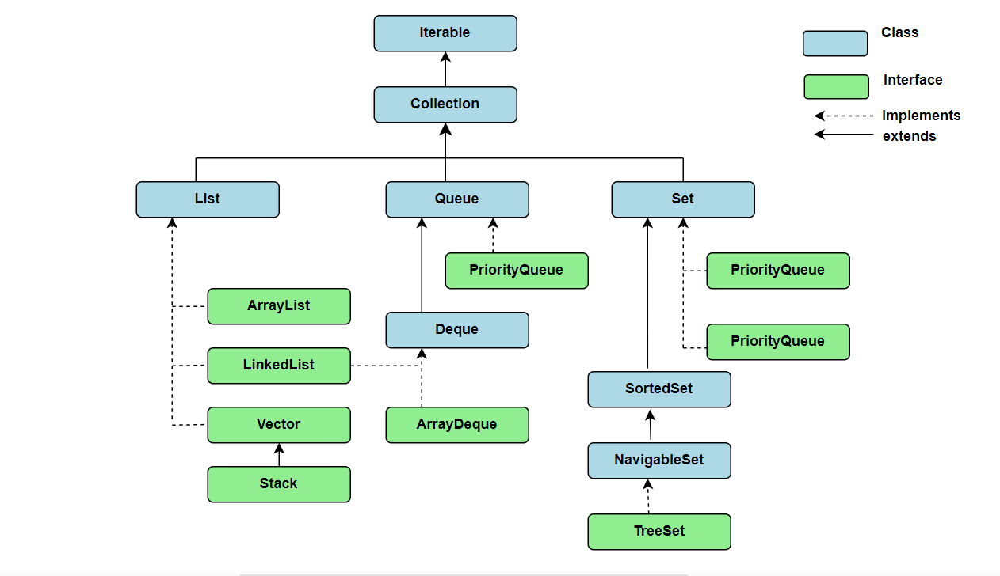

# **Java Interview Questions**

This document serves as a comprehensive guide for Java interview preparation, covering fundamental to advanced topics with structured explanations.

---

# Core Java

## Table of Contents

| Sr. No. | Questions                                                                                                                                                |
| ------- | -------------------------------------------------------------------------------------------------------------------------------------------------------- |
| 1       | [What is JVM, JRE, and JDK?](#1-what-is-jvm-jre-and-jdk)                                                                                                 |
| 2       | [What are the main features of Java?](#2-what-are-the-main-features-of-java)                                                                             |
| 3       | [Why is Java not a pure object-oriented language?](#3-why-is-java-not-a-pure-object-oriented-language)                                                   |
| 4       | [What is a classloader and what are its types?](#4-what-is-a-classloader-and-what-are-its-types)                                                         |
| 5       | [What is the difference between an Instance variable and a Local variable?](#5-what-is-the-difference-between-an-instance-variable-and-a-local-variable) |
| 6       | [What are memory allocations available in Java?](#6-what-are-memory-allocations-available-in-java)                                                       |
| 7       | [Why are Java Strings immutable?](#7-why-are-java-strings-immutable)                                                                                     |
| 8       | [What is the difference between String, StringBuffer, and StringBuilder?](#8-what-is-the-difference-between-string-stringbuffer-and-stringbuilder)       |
| 9       | [What is Garbage Collection in Java and how does it work?](#9-what-is-garbage-collection-in-java-and-how-does-it-work)                                   |
| 10      | [What is the importance of hashCode() and equals() methods?](#10-what-is-the-importance-of-hashcode-and-equals-methods)                                  |
| 11      | [What are Checked and Unchecked Exceptions in Java?](#11-what-are-checked-and-unchecked-exceptions-in-java)                                              |
| 12      | [What is the difference between an Abstract Class and an Interface?](#12-what-is-the-difference-between-an-abstract-class-and-an-interface)              |
| 13      | [What are final, finally, and finalize in Java?](#13-what-are-final-finally-and-finalize-in-java)                                                        |
| 14      | [What are Marker Interfaces in Java?](#14-what-are-marker-interfaces-in-java)                                                                            |
| 15      | [What is the Serializable Interface in Java?](#15-what-is-the-serializable-interface-in-java)                                                            |
| 16      | [What is the Collections Framework in Java?](#16-what-is-the-collections-framework-in-java)                                                              |
| 17      | [What is the Difference Between the Comparable and Comparator Interfaces?](#17-what-is-the-difference-between-the-comparable-and-comparator-interfaces)  |
| 18      | [What is an Inner Class in Java?](#18-what-is-an-inner-class-in-java)                                                                                    |
| 19      | [What is Method Overloading and Method Overriding?](#19-what-is-method-overloading-and-method-overriding)                                                |
| 20      | [Array vs. ArrayList in Java](#20-array-vs-arraylist-in-java)                                                                                            |
| 21      | [How ArrayList Works Internally](#21-how-arraylist-works-internally)                                                                                     |
| 22      | [What is a LinkedList and how does it work?](#22-what-is-a-linkedlist-and-how-does-it-work)                                                              |
| 23      | [What is the difference between ArrayList and LinkedList?](#23-what-is-the-difference-between-arraylist-and-linkedlist)                                  |
| 24      | [What is the difference between HashMap, HashSet, TreeMap, and TreeSet?](#24-what-is-the-difference-between-hashmap-hashset-treemap-and-treeset)         |
| 25      | [What is the difference between HashMap and ConcurrentHashMap?](#25-what-is-the-difference-between-hashmap-and-concurrenthashmap)                        |
| 26      | [What is Java Reflection API?](#26-what-is-java-reflection-api)                                                                                          |
| 27      | [If Reflection is risky, why does Java still have it?](#27-if-reflection-is-risky-why-does-java-still-have-it)                                           |

---

## Questions and Answers

### 1. What is a Singleton class and how do you create one?

#### 1. Definition

A **Singleton Class** is a design pattern that restricts the instantiation of a class to **one single instance** across the entire application runtime. It provides a global point of access to that specific instance.

To create a standard, production-ready Singleton class in Java, you must satisfy three core implementation rules:

1. **Private Constructor:** Prevents other classes from instantiating the class using the `new` keyword.
2. **Private Static Instance Variable:** Holds the single, unique instance of the class in static memory.
3. **Public Static Factory Method:** Acts as the entry point, allowing global access to the single instance. It lazily initializes the instance on the first request and returns the cached instance for all subsequent calls.

> 🔒 **Thread Safety Note:** In a multithreaded application, you must use **Double-Checked Locking** along with the `volatile` keyword. This prevents multiple threads from accidentally initializing separate instances simultaneously when accessing the factory method for the first time.

---

#### 2. Code Example

```
public class DatabaseConnectionManager {

    // 1. A private static variable to hold the single instance.
    // 'volatile' ensures changes made by one thread are instantly visible to others.
    private static volatile DatabaseConnectionManager instance;

    // 2. A private constructor prevents other classes from using the 'new' keyword.
    private DatabaseConnectionManager() {
        System.out.println("Connection Manager Initialized!");
    }

    // 3. A public static method to provide global access to the instance.
    public static DatabaseConnectionManager getInstance() {
        // First check (no locking): Fast path if the instance already exists
        if (instance == null) {

            // Synchronize on the class block so only one thread can enter at a time
            synchronized (DatabaseConnectionManager.class) {

                // Second check (with locking): Ensures another thread didn't create it
                // while this thread was waiting for the lock.
                if (instance == null) {
                    instance = new DatabaseConnectionManager();
                }
            }
        }
        return instance;
    }

    // A dummy method to simulate a class action
    public void connect() {
        System.out.println("Connected securely to the database.");
    }
}

```

### 2. What are the key features of the Java 8 Stream API?

#### 1. Definition

The **Java 8 Stream API** introduced a functional, declarative approach to processing sequences of elements (collections, arrays, or I/O channels). Instead of writing imperative, nested `for` loops to filter, map, and aggregate data, a Stream lets you pipe operations together in a fluent chain.

> Key characteristics and architectural features include:

- **No Data Storage:** A Stream is not a data structure; it does not store elements. Instead, it carries data from a source (like a `Collection`) through a pipeline of computational operations.
- **Functional in Nature:** Operations on a stream produce a result but do not modify the underlying data source (immutability).
- **Lazy Evaluation:** Intermediate operations (like `filter()` or `map()`) do not execute until a terminal operation (like `collect()` or `forEach()`) is triggered.
- **Pipelined Operations:** Stream operations are categorized into two types:
  1. _Intermediate Operations:_ Return a new stream, enabling method chaining (e.g., `filter()`, `map()`, `sorted()`, `distinct()`).
  2. _Terminal Operations:_ Traverse the pipeline, produce a final result and close the stream (e.g., `collect()`, `count()`, `forEach()`).
- **Parallel Processing:** You can switch from sequential to parallel execution using `.parallelStream()`, splitting the workload across available CPU cores automatically.

---

#### 2. Code Example

```java
import java.util.Arrays;
import java.util.List;
import java.util.stream.Collectors;

class Account {
    private String owner;
    private String type; // "SAVINGS", "BUSINESS", etc.
    private double balance;

    public Account(String owner, String type, double balance) {
        this.owner = owner;
        this.type = type;
        this.balance = balance;
    }
    public String getType() { return type; }
    public double getBalance() { return balance; }
    public String getOwner() { return owner; }
}

public class BankStreamProcessing {
    public static void main(String[] args) {
        List<Account> branchAccounts = Arrays.asList(
            new Account("Alice", "SAVINGS", 1200.0),
            new Account("Acme Corp", "BUSINESS", 45000.0),
            new Account("Bob", "SAVINGS", 8500.0),
            new Account("Globex Industries", "BUSINESS", 120000.0),
            new Account("Charlie", "BUSINESS", 3000.0)
        );

        // STREAM PIPELINE: Processing data declaratively
        List<String> premiumBusinessClients = branchAccounts.stream()
            .filter(acc -> acc.getType().equals("BUSINESS"))          // Intermediate 1: Filter business accounts
            .filter(acc -> acc.getBalance() >= 10000.0)               // Intermediate 2: Filter high-value balances
            .map(acc -> acc.getOwner().toUpperCase())                 // Intermediate 3: Transform names to uppercase
            .sorted()                                                 // Intermediate 4: Sort alphabetically
            .collect(Collectors.toList());                            // Terminal Operation: Materialize into a new List

        System.out.println("Premium Business Clients: " + premiumBusinessClients);
    }
}
```

### 1. What is JVM, JRE, and JDK?

- **JVM (Java Virtual Machine):** It is a machine that provides the runtime environment in which Java bytecode can be executed. JVM is platform-dependent (different for Windows, Mac, Linux), but it is what makes Java bytecode platform-independent.
- **JRE (Java Runtime Environment):** It is a software package that provides the minimum requirements for executing a Java application. It contains the JVM, core libraries, and other supporting files. It does not contain development tools like compilers or debuggers.
- **JDK (Java Development Kit):** It is a full-featured software development kit required to develop and execute Java applications. It contains everything that JRE has, plus development tools such as the Java compiler (`javac`), debugger, and javadoc tool.

**Relationship:** `JDK = JRE + JVM`.

---

### 2. What are the main features of Java?

- **Simple:** Easy to learn, and its syntax is clean and concise.
- **Object-Oriented:** Everything in Java is an Object (except primitive types), following concepts like Inheritance, Polymorphism, Abstraction, and Encapsulation, Interfaces.
- **Platform Independent:** Follows the "Write Once, Run Anywhere" philosophy. Code is compiled into bytecode, which runs on any machine with a JVM.
- **Secure:** Java runs inside a virtual machine sandbox, no explicit pointers, and offers automated memory management.
- **Robust:** Emphasizes early checking for possible errors, with strong compile-time and runtime error-checking, plus a robust Exception Handling framework.
- **Multithreaded:** Java has built-in support for writing programs that can perform many tasks concurrently.

---

### 3. Why is Java not a pure object-oriented language?

Java is not considered a pure object-oriented language because it supports **primitive data types** (such as `int`, `char`, `float`, `double`, `boolean`, etc.) which are not objects. In a pure object-oriented language, everything must be an object. While Java provides wrapper classes (`Integer`, `Character`, etc.) and autoboxing, the baseline existence of primitives prevents it from being 100% pure.

---

### 4. What is a classloader and what are its types?

A **Classloader** is a part of the JRE that dynamically loads Java classes into the JVM during runtime when they are referenced for the first time.

There are three main types of built-in classloaders in Java:

1.  **Bootstrap Classloader:** Loads core Java platform classes from the JDK internal packages (like `java.lang.*`, `java.util.*` via `rt.jar` or module systems).
2.  **Extension / Platform Classloader:** Loads classes from the extension directories or platform-specific extensions.
3.  **Application / System Classloader:** Loads the application-specific classes from the environment paths specified by the system `CLASSPATH` variable or `-classpath` option.

---

### 5. What is the difference between an Instance variable and a Local variable?

- **Instance Variable:** Declared inside a class but outside any method, constructor, or block. They are created when an object is instantiated and are accessible to all methods of the class. They take default values if uninitialized.
- **Local Variable:** Declared inside a method, constructor, or block. They are created when the block is entered and destroyed on exit. They do not have default values and must be initialized before use.

---

### 6. What are memory allocations available in Java?

Java separates runtime memory primarily into two sectors:

- **Heap Memory:** Used for allocating memory to objects and instance variables dynamically during runtime. All objects created via the `new` keyword reside here. It is shared across all threads.
- **Stack Memory:** Used for execution threads. It holds short-lived local variables, references to objects in the heap, and method invocation frames. Each thread has its own private stack memory.

---

### 7. Why are Java Strings immutable?

Strings are immutable (cannot be changed once created) for several design reasons:

- **String Pool:** Java optimizes memory by storing string literals in a common "String Constant Pool". Multiple references can point to the same literal. If strings were mutable, changing one reference would unintentionally alter the values for other references.
- **Security:** Strings are widely used as parameters for network connections, database URLs, file paths, and username/password entries. Immutability ensures these vital parameters cannot be altered during execution.
- **Thread Safety:** Since they cannot be modified, strings are inherently thread-safe and can be shared among multiple threads without synchronization.
- **Caching HashCode:** The hashcode of a string is cached during its creation. This makes it highly efficient when used as keys in HashMaps or HashSets.

---

### 8. What is the difference between String, StringBuffer, and StringBuilder?

- **String:** Immutable sequence of characters. Modifications create new objects in memory. Slowest performance under frequent manipulations.
- **StringBuffer:** Mutable sequence of characters. It is `synchronized` (thread-safe), meaning multiple threads cannot access it simultaneously. Slightly slower than StringBuilder due to synchronization overhead.
- **StringBuilder:** Mutable sequence of characters. It is `non-synchronized` (not thread-safe). It provides faster performance than StringBuffer and is preferred for single-threaded operations.

<div style="text-align: center;">

</div>

---

### 9. What is Garbage Collection in Java and how does it work?

**Garbage Collection (GC)** is an automatic memory management process in Java that tracks allocations and deletes objects that are no longer reachable or referenced by any active part of the program.

- It runs as a background daemon thread managed by the JVM.
- Developers can request garbage collection using `System.gc()`, but execution is never guaranteed immediately.
- The heap is typically divided into **Young Generation** (Eden, Survivor spaces) where new objects are born, and **Old/Tenured Generation** where long-lived objects are promoted. GC algorithms (like G1, ZGC, or CMS) selectively scan these regions to free memory.

### 10. What is the importance of hashCode() and equals() methods?

- **equals(Object obj)**: A method defined in the Object class used to compare two objects for "meaningful" or logical equality. By default, the Object class implementation uses the == operator, which only checks if both references point to the exact same memory address (shallow equality). Developers override it to compare actual values inside the objects (deep equality).

- **hashCode()**: A method defined in the Object class that returns an integer value (hash code) associated with the object. It is used by hash-based collections to determine where to store and look up objects efficiently.

- **Why we need it?**: In Java, there is a strict contract between `equals() and hashCode()`. If you override one, you must override the other. The contract states:

  These methods are heavily utilized by Java's Hashing Collections framework:
  - HashMap keys
  - HashSet elements
  - Hashtable keys
  - LinkedHashSet / LinkedHashMap

- **Real-Life Analogy**: The University Library
  Imagine a massive university library with thousands of student files stored in physical folders.

  ```
  [Library Filing System]
  ├── Cabinet 60 (Hash Code Area)
  │     ├── File: John Smith, ID: 1060  <-- (equals() checks the ID)
  │     └── File: Alice Poe,  ID: 2060
  └── Cabinet 75
          └── File: Bob Miller, ID: 1075
  ```

  **The Scenario**: You need to find a specific student's physical file.

  hashCode() is the Cabinet Number: Instead of walking through thousands of files one by one, the librarian uses a `hash` formula.

  equals() is checking the actual ID Card: Once you open Cabinet 60, there are 5 or 6 files inside. You pull them out and carefully look at the printed Student ID and Name.

```java
import java.util.Objects;
import java.util.HashSet;

public class Student {
    private int id;
    private String name;

    // Constructor
    public Student(int id, String name) {
        this.id = id;
        this.name = name;
    }

    // Getters
    public int getId() { return id; }
    public String getName() { return name; }

    // 1. Overriding equals method
    @Override
    public boolean equals(Object obj) {
        // Step 1: Check if the object is compared with itself
        if (this == obj) {
            return true;
        }

        // Step 2: Check if the passed object is null or of a different class
        if (obj == null || getClass() != obj.getClass()) {
            return false;
        }

        // Step 3: Typecast the object to compare the fields
        Student student = (Student) obj;

        // Step 4: Compare significant fields (id and name)
        // Using Objects.equals to handle potential null values safely
        return this.id == student.id && Objects.equals(this.name, student.name);
    }

    // 2. Overriding hashCode method
    @Override
    public int hashCode() {
        // Generates a hash code based on the exact same fields used in equals()
        return Objects.hash(id, name);
    }

    // Main method to test the functionality
    public static void main(String[] args) {
        Student s1 = new Student(101, "Alex");
        Student s2 = new Student(101, "Alex"); // Logically equal to s1
        Student s3 = new Student(102, "Blake");

        // Testing equals()
        System.out.println("Is s1 equal to s2? " + s1.equals(s2)); // Expected: true
        System.out.println("Is s1 equal to s3? " + s1.equals(s3)); // Expected: false

        // Testing hashCode() consistency
        System.out.println("s1 HashCode: " + s1.hashCode());
        System.out.println("s2 HashCode: " + s2.hashCode()); // Expected: Same as s1

        // Testing behavior inside a Hashing Collection (HashSet)
        HashSet<Student> studentSet = new HashSet<>();
        studentSet.add(s1);
        studentSet.add(s2); // Attempting to add a logical duplicate

        // Because we overrode equals and hashCode, HashSet correctly identifies the duplicate
        System.out.println("HashSet size: " + studentSet.size()); // Expected: 1
    }
}
```

### 11. What are Checked and Unchecked Exceptions in Java?

#### **1. Definitions**

- **Checked Exceptions:** These are exceptions that are checked by the compiler at compile-time. If a method throws a checked exception, the code must either handle it using a `try-catch` block or declare it in the method signature using the `throws` keyword.
- **Unchecked Exceptions:** These are exceptions that occur at runtime and are not checked by the compiler.

#### **2. Why We Need It**

- **Checked Exceptions:** These are used for scenarios where an error is **outside the control of the program** (like a network failure), forcing the developer to provide a recovery plan.
- **Unchecked Exceptions:** These represent **programming errors or flaws in logic** (bugs). Since these should be fixed by the programmer rather than "handled" at runtime, the compiler does not force a `try-catch`.

#### **3. Where Do We Use It? (Common Examples)**

- **Checked Exceptions:**
  - `IOException`: Error during input/output operations.
  - `FileNotFoundException`: Attempting to access a file that does not exist.
  - `SQLException`: Errors related to database access.
- **Unchecked Exceptions:**
  - `NullPointerException`: Accessing a method or field of a `null` object.
  - `ArrayIndexOutOfBoundsException`: Accessing an invalid index in an array.
  - `ArithmeticException`: Invalid math operations, like dividing by zero.

#### **4. Real-Life Analogy: International Travel vs. Going to Work**

Imagine your program execution as your daily routine:

- **Checked Exception (Airport Security):** Before you can board a flight, security checks if you have a documents. You are stopped **before** you start the journey if you aren't prepared. The rules force you to have your documents ready in advance.
- **Unchecked Exception (Stubbing Your Toe):** While walking to work, you might met with an accident. You don't prepare a medical kit at the door for this specific event because it is an unpredictable accident.

### 12. What is the difference between an Abstract Class and an Interface?

#### **1. Definitions**

- **Abstract Class:** A half-built class that cannot be used on its own to create an object. It is used as a common base for other closely related classes. It can have both normal methods (with code) and abstract methods (empty methods with no code).
- **Interface:** A blueprint or rulebook that focuses on what a class can do. While it used to only hold empty methods, modern Java (Java 8+) allows interfaces to have **default** and **static** methods with actual code blocks, as well as **private** methods (Java 9+).

#### **2. Why We Need It & Main Differences**

- **Multiple Inheritance (The Biggest Difference):** A class can extend only **one** abstract class. However, a class can implement **multiple** interfaces at the exact same time.
- **State and Variables:** An abstract class can have normal instance variables (like `int score;`) that can change. An interface **cannot** have instance variables; any variable declared in an interface is automatically a constant (`public static final`) and cannot be changed.
- **Constructors:** An abstract class can have constructors to initialize its state. An interface **cannot** have constructors.
- **Method Implementation:** An abstract class has always allowed any method to have code. An interface primarily defines empty rules, but allows `default` methods for backward compatibility and `static`/`private` methods for helper code.

#### **3. Where Do We Use It? (Common Examples)**

- **Abstract Class:** Use it when classes are deeply related and need to share data fields and constructors.
  - _Example:_ An abstract class `Animal` with a variable `age`, a constructor, a normal method `breathe()`, and an empty method `makeSound()`.
- **Interface:** Use it when you want completely unrelated classes to have the same capability or behavior.
  - _Example:_ An interface `Brakable` with a `default void checkBrakes()` method. This can be used on a `Car`, a `Bicycle`, or a `Train`—different things that all need to stop.

#### **4. Real-Life Analogy: A Base House Blueprint vs. A Smart Home Certificate**

Imagine you are building a modern neighborhood:

- **Abstract Class (The Base House Blueprint):** You have a core blueprint called `BaseHouse`. It provides concrete structures like pre-built walls, plumbing, and a foundation layout (normal methods, fields, and constructors). You can only choose **one** base structural blueprint to build your house.
- **Interface (The Smart Home Certificate):** The city gives you a certificate rulebook called `SmartHomeEnabled`. Its main job is to list rules like _"You must have a digital lock."_ (abstract method). However, the rulebook also gives you a pre-written setup guide on how to link a phone to the lock (**default method**) and a troubleshooting hotline number (**static/private helper method**). Your house can easily follow **many** different certificates at once, like `SmartHomeEnabled`, `FireSafe`, and `EcoFriendly`.

#### **4. Code Example**

```java
// Abstract Class Example
abstract class Vehicle {
    int speed; // Allowed: instance variable

    Vehicle(int speed) { // Allowed: Constructor
        this.speed = speed;
    }

    void start() { // Normal method with code
        System.out.println("Vehicle started");
    }

    abstract void shiftGear(); // Abstract method (No code)
}

// Interface Example
interface Flyable {
    int MAX_ALTITUDE = 10000; // Allowed: Constant (public static final)

    void fly(); // Abstract method (No code)

    default void land() { // Java 8+ Default method (Has code)
        System.out.println("Landing safely...");
    }
}

// A class can extend ONE abstract class AND implement MULTIPLE interfaces
class FlyingCar extends Vehicle implements Flyable {

    FlyingCar() {
        super(120); // Calls the abstract class constructor
    }

    @Override
    void shiftGear() {
        System.out.println("Shifting to flight gear");
    }

    @Override
    public void fly() {
        System.out.println("Flying at speed: " + speed);
    }
}
```

### 13. What are final, finally, and finalize in Java?

#### **1. Definitions**

- **`final`:** A keyword used to apply restrictions. It can be applied to variables, methods, and classes.
  - A `final` **variable** cannot be reassigned (it becomes a constant).
  - A `final` **method** cannot be overridden by a subclass.
  - A `final` **class** cannot be extended (inherited).
- **`finally`:** A control block used alongside `try` and `catch`. Code inside the `finally` block is **always executed**, whether an exception is thrown or not, and whether it is caught or not. It is primarily used for cleanup activities.
- **`finalize()`:** A protected method belonging to the `Object` class. It is invoked by the Garbage Collector right before an object is permanently destroyed from memory, giving the object a last chance to clean up its resources. _(Note: It has been deprecated in modern Java because it is unpredictable, but still asked in interviews)._

#### **2. Why We Need It & Main Differences**

| Feature          | `final`                                                       | `finally`                                                                        | `finalize()`                                                          |
| :--------------- | :------------------------------------------------------------ | :------------------------------------------------------------------------------- | :-------------------------------------------------------------------- |
| **What is it?**  | A **Keyword**                                                 | A **Code Block**                                                                 | A **Method**                                                          |
| **Context**      | Used with variables, methods, and classes.                    | Used with `try-catch` structures for exception handling.                         | Used by the Garbage Collector before deleting objects.                |
| **Main Purpose** | To create constants or prevent modifications/inheritance.     | To guarantee cleanup operations (e.g., closing file streams or network sockets). | To perform last-minute cleanup of resources before memory is freed.   |
| **Execution**    | Checked at compile-time and strictly enforced during runtime. | Executes immediately after the `try` or `catch` blocks finish.                   | Executes unpredictably whenever the Garbage Collector decides to run. |

---

#### **3. Code Example**

```java
// 1. final keyword example
final class ReserveBank { // This class CANNOT be extended
    final int TRANS_LIMIT = 50000; // Value CANNOT be changed

    final void processTxn() { // This method CANNOT be overridden
        System.out.println("Processing transaction safely...");
    }
}

public class BankDemo {
    // 3. finalize method example
    @Override
    protected void finalize() {
        System.out.println("Closing temporary database connection before object dies...");
    }

    public static void main(String[] args) {
        // 2. finally block example
        try {
            System.out.println("Opening Secure ATM Network Session...");
            int result = 500 / 0; // Throws an ArithmeticException
        } catch (ArithmeticException e) {
            System.out.println("Error: Cannot divide by zero.");
        } finally {
            // This code runs NO MATTER WHAT to prevent security leaks
            System.out.println("CRITICAL CLEANUP: Closing ATM Session safely.");
        }
    }
}

```

### 14. What are Marker Interfaces in Java?

#### **1. Definitions**

- **Marker Interface:** An interface that does not contain any methods, fields, or constants. It is completely empty. Its only purpose is to "deliver a message" or act as a marker to JVM, indicating that a class has a special capabilities.

---

#### **2. Why We Need It & Main Differences**

- **Metadata via Tagging:** Before Java introduced Annotations (like `@Override`), marker interfaces were the only clean way to label a class as having special properties.
- **JVM Permission:** It signals the JVM to allow specific low-level tasks (like cloning an object or sending it over a network) that would normally throw an exception if done on an un-tagged class.
- **Alternative:** In modern Java, annotations (e.g., `@Serializable`) are often used instead of marker interfaces to achieve similar tagging results.

---

#### **3. Common Examples**

Java provides several built-in marker interfaces:

- `Serializable`: Tells the JVM that this class's objects can be converted into a stream of bytes and sent over a network or saved to a database.
- `Cloneable`: Gives permission to a class to use the `Object.clone()` method to make exact copies of itself. Without it, calling `clone()` throws a `CloneNotSupportedException`.
- `Remote`: Tells the JVM that the methods inside this object can be executed from a completely different computer (Remote Method Invocation).

---

#### **4. Code Example**

````java
import java.io.Serializable;

// 1. Marking the class with an empty Marker Interface
// This gives the class permission to be saved or sent over a network
class BankAccount implements Serializable {
    private static final long serialVersionUID = 1L; // Best practice for tracking version

    String accountHolder;
    double balance;

    BankAccount(String accountHolder, double balance) {
        this.accountHolder = accountHolder;
        this.balance = balance;
    }
}

public class MarkerDemo {
    public static void main(String[] args) {
        BankAccount myAccount = new BankAccount("Alice", 25000.0);

        // 2. The JVM checks for the tag at runtime
        if (myAccount instanceof Serializable) {
            System.out.println("Success: This account is tagged! Ready to be saved to the database vault.");
        } else {
            System.out.println("Error: Blocked! Missing security marker tag.");
        }
    }
}

### 15. What is the Serializable Interface in Java?

#### **1. Definitions**
* **Serialization:** The process of converting the state of a live Java object into a linear stream of bytes (a raw binary format). This stream of bytes can then be saved into a local file, stored inside a database vault, or sent across a network to another machine.
* **Deserialization:** The exact reverse process. It takes that raw stream of bytes and reconstructs it back into a live, fully functional Java object in memory.
* **`Serializable` Interface:** A built-in marker interface (it contains no methods or fields) that acts as an explicit "opt-in" permit. By implementing it, a class gives permission to the JVM to flatten and save its objects.

---

#### **2. Why We Need It & Crucial Concepts**
* **Data Persistence:** Normal Java objects live entirely in volatile RAM (Heap Memory). When the JVM shuts down, all objects die instantly. Serialization allows you to save an object's exact state so it can be brought back to life tomorrow.
* **The `transient` Keyword:** If your class has a sensitive field (like a customer's banking PIN or password), you can label it as `transient`. The JVM will completely ignore this field during serialization, leaving it blank or null when the object is restored to protect security.
* **`serialVersionUID`:** A unique version ID stamp (a `long` number) placed on the serialized data. When rebuilding the object later, the JVM verifies this number to make sure the class definition has not been changed or corrupted in the meantime.

---

#### **3. Code Example**

```java
import java.io.Serializable;

// Implementing Serializable gives the JVM permission to save this object
class CustomerProfile implements Serializable {
    // Unique version ID stamp for tracking changes
    private static final long serialVersionUID = 1L;

    String customerName;
    double balance;

    // The transient keyword protects sensitive fields from being saved
    transient String atmPin;

    CustomerProfile(String customerName, double balance, String atmPin) {
        this.customerName = customerName;
        this.balance = balance;
        this.atmPin = atmPin;
    }
}```
````

### 16. What is the Serializable Interface in Java?

#### **1. Definitions**

- **Serialization:** The process of converting the state of a live Java object into a linear stream of bytes (a raw binary format). This stream of bytes can then be saved into a stored inside a database, or sent across a network to another machine.
- **Deserialization:** The exact reverse process. It takes that raw stream of bytes and reconstructs it back into a live, fully functional Java object in memory.
- **`Serializable` Interface:** A built-in marker interface (it contains no methods or fields). By implementing it, a class gives permission to the JVM to flatten and save its objects.

---

#### **2. Why We Need It & Crucial Concepts**

- **Data Persistence:** Normal Java objects live entirely in RAM (Heap Memory). When the JVM shuts down, all objects die instantly. Serialization allows you to save an object's exact state so it can be brought back to life tomorrow.
- **The `transient` Keyword:** If your class has a sensitive field (like a customer's banking PIN or password), you can make it as `transient`. The JVM will completely ignore this field during serialization, leaving it blank or null when the object is restored to protect security.
- **`serialVersionUID`:** A unique version ID stamp (a `long` number) placed on the serialized data. When rebuilding the object later, the JVM verifies this number to make sure the class definition hasn't been changed or corrupted in the meantime.

---

#### **3. Code Example**

```java
import java.io.Serializable;

// Implementing Serializable gives the JVM permission to save this object
class CustomerProfile implements Serializable {
    // Unique version ID stamp for tracking changes
    private static final long serialVersionUID = 1L;

    String customerName;
    double balance;

    // The transient keyword protects sensitive fields from being saved
    transient String atmPin;

    CustomerProfile(String customerName, double balance, String atmPin) {
        this.customerName = customerName;
        this.balance = balance;
        this.atmPin = atmPin;
    }


}
```

### 16b. If a PIN is marked transient, how does the Bank store it in the Database?

#### **1. The Core Interview Concept**

- **Why we use transient here:** The `transient` keyword says: _"Do not send this raw field through the default, unencrypted Java Serialization pipe."_
- **The Secure Solution:** To save the ATM PIN, the bank bypasses standard Java serialization for that specific field. Instead, the PIN is **extracted separately, securely hashed (or encrypted)**, and then safely pushed into a dedicated, encrypted database column.

---

#### **2. Code Example (The Secure Way)**

```java
import java.io.Serializable;

class SecureCustomerProfile implements Serializable {
    private static final long serialVersionUID = 1L;

    String customerName;
    double balance;

    // 1. Blocked from raw, default Java serialization
    transient String rawAtmPin;

    SecureCustomerProfile(String customerName, double balance, String rawAtmPin) {
        this.customerName = customerName;
        this.balance = balance;
        this.rawAtmPin = rawAtmPin;
    }

    // 2. Custom Method used by the DAO/Database Layer to safely extract and store the PIN
    public String getEncryptedPinForDatabase() {
        // Real banks NEVER store raw text PINs. We hash them first!
        return SecurityUtils.convertToSecureHash(this.rawAtmPin);
    }
}
```

### 16. What is the Collections Framework in Java?

#### **1. Definitions**

- **Collection:** A single object that acts as a container to group, hold, and organize multiple individual elements (like a list of names or a set of numbers).
- **Collections Framework:** A unified architecture in Java (found in the `java.util` package) that provides a set of pre-built interfaces, classes, and algorithms to manipulate collections easily. It handles data structures (like dynamic arrays, linked lists, and trees) out of the box.

---

#### **2. Why We Need It**

- **The Problem with Arrays:** Normal Java arrays have a **fixed size**. Once you create an array of size 5, you can never add a 6th item without creating a brand-new array and copying everything over manually.
- **The Collections Solution:** The Collections Framework provides dynamic data structures that automatically shrink or grow as you add or remove items. It also provides ready-made, highly optimized ways to sort, search, and filter data with minimal code.

---

#### **3. The Core Hierarchy (The Three Pillars)**

The framework is built on a few primary interfaces:

1. **`List` (Ordered & Allows Duplicates):** Keeps elements in the exact order they were inserted. Items can be accessed using an index number (like `0, 1, 2`). _Examples: `ArrayList`, `LinkedList`_.
2. **`Set` (Unordered & No Duplicates):** A strict container that guarantees every single element inside it is completely unique. _Examples: `HashSet`, `TreeSet`_.
3. **`Map` (Key-Value Pairs):** Technically doesn't inherit from the `Collection` interface, but is a vital part of the framework. It stores data like a dictionary using a unique identifier (Key) to look up a value. _Examples: `HashMap`, `TreeMap`_.

---

#### **4. Code Example**

```java
import java.util.ArrayList;
import java.util.HashSet;
import java.util.HashMap;

public class CollectionsDemo {
    public static void main(String[] args) {

        // 1. LIST: Keeps track of transaction history in order
        ArrayList<String> history = new ArrayList<>();
        history.add("Deposited $100");
        history.add("Withdrew $20");
        history.add("Deposited $100"); // Allowed: Duplicates are fine

        // 2. SET: Keeps track of unique active account numbers
        HashSet<Integer> activeAccounts = new HashSet<>();
        activeAccounts.add(4455);
        activeAccounts.add(8899);
        activeAccounts.add(4455); // Ignored: Set automatically blocks duplicates

        // 3. MAP: Maps an Account Number (Key) to the Customer Name (Value)
        HashMap<Integer, String> accountLog = new HashMap<>();
        accountLog.put(4455, "Alice");
        accountLog.put(8899, "Bob");

        System.out.println("Transaction History: " + history);
        System.out.println("Unique Account Numbers: " + activeAccounts);
        System.out.println("Account Owner for 4455: " + accountLog.get(4455));
    }
}

```

#### **5. Collection Framework Hierarchy:**

<!-- <div style="text-align: center;"> -->

<!-- </div> -->

### 16. What is the Difference Between the Comparable and Comparator Interfaces?

#### **1. Definitions**

- **`Comparable`:** An interface used to define the **natural (default) sorting order** for a class. The class itself must implement this interface and override the `compareTo()` method.
- **`Comparator`:** An interface used to define **custom (alternative) sorting orders**. It is implemented in a separate helper class (or via a Lambda expression) and overrides the `compare()` method.

---

#### **2. Main Differences (Comparison Table)**

| Feature                | `Comparable`                                                           | `Comparator`                                                    |
| :--------------------- | :--------------------------------------------------------------------- | :-------------------------------------------------------------- |
| **Sorting Type**       | Defines the **Natural / Default** sorting order.                       | Defines **Custom / Multiple** alternative sorting orders.       |
| **Method to Override** | `public int compareTo(T o)`                                            | `public int compare(T o1, T o2)`                                |
| **Package**            | Found in `java.lang` (no import needed).                               | Found in `java.util` (requires importing).                      |
| **Class Modification** | Modifies the actual original class source code.                        | Does not modify the original class at all.                      |
| **Arguments**          | Takes only **one** object as an argument (compares `this` to `other`). | Takes **two** objects as arguments (compares `obj1` to `obj2`). |
| **Usage**              | Called using `Collections.sort(list)`.                                 | Called using `Collections.sort(list, new MyComparator())`.      |

---

#### **3. Code Example**

```java
import java.util.ArrayList;
import java.util.Collections;
import java.util.Comparator;

// 1. COMPARABLE: Modifies the actual class to set the DEFAULT sort (by Account Number)
class BankAccount implements Comparable<BankAccount> {
    int id;
    String owner;
    double balance;

    BankAccount(int id, String owner, double balance) {
        this.id = id;
        this.owner = owner;
        this.balance = balance;
    }

    @Override
    public int compareTo(BankAccount other) {
        // Sorts naturally by ID in ascending order
        return this.id - other.id;
    }
}

// 2. COMPARATOR: External helper logic for CUSTOM sort (by Balance) without touching the original class
class BalanceComparator implements Comparator<BankAccount> {
    @Override
    public int compare(BankAccount b1, BankAccount b2) {
        return Double.compare(b1.balance, b2.balance);
    }
}

public class SortingDemo {
    public static void main(String[] args) {
        ArrayList<BankAccount> list = new ArrayList<>();
        list.add(new BankAccount(303, "Alice", 5000.0));
        list.add(new BankAccount(101, "Bob", 12000.0));
        list.add(new BankAccount(202, "Charlie", 2500.0));

        // Sorting using Comparable (Default: by ID)
        Collections.sort(list);
        System.out.println("Sorted by ID (Default): " + list.get(0).owner); // Will be Bob (101)

        // Sorting using Comparator (Custom: by Balance)
        Collections.sort(list, new BalanceComparator());
        System.out.println("Sorted by Balance (Custom): " + list.get(0).owner); // Will be Charlie (2500.0)
    }
}
```

### 18b. Why do we use them and which one should we use?

#### **1. Why do we use them?**

If you try to sort a list of primitive types like `Integer` or `String` in Java using `Collections.sort()`, it works instantly because Java already knows how to compare numbers ($1 < 2$) and letters ($A < B$).

However, if you pass a list of custom objects (like `BankAccount`), Java gets confused: _"Should I sort by account ID, by the customer's name, or by the money balance?"_ We use **Comparable** and **Comparator** to give Java the precise mathematical logic it needs to compare complex, custom objects. Without them, `Collections.sort()` will throw a compilation error.

---

#### **2. Which one should we use? (Decision Framework)**

Instead of guessing, follow this industry-standard rule of thumb during design:

- **Use `Comparable` when there is a clear, undisputed, "Natural" default order** for the object that everyone in your team agrees on (e.g., sorting transactions chronologically by Time, or accounts by ID).
- **Use `Comparator` when you need flexibility, multiple sorting options, or are dealing with code you dont own.**

---

#### **3. Real-World Engineering Scenarios (When to pick which)**

| Scenario                                                                                    | Best Choice      | Why?                                                                                                                |
| :------------------------------------------------------------------------------------------ | :--------------- | :------------------------------------------------------------------------------------------------------------------ |
| **Sorting by default ID/Timestamp**                                                         | **`Comparable`** | It establishes a permanent, clean base order for the object across the whole application.                           |
| **Building a UI with Sortable Columns** _(Click to sort by Name, Click to sort by Balance)_ | **`Comparator`** | You need multiple sorting logic options for the exact same object. `Comparable` only allows one.                    |
| **Sorting classes from a 3rd-Party Library** _(e.g., AWS SDK, Spring Framework)_            | **`Comparator`** | You cannot modify their source code to add `implements Comparable`. A `Comparator` works entirely from the outside. |
| **Keeping your code decoupled and clean (SOLID Principles)**                                | **`Comparator`** | It keeps sorting logic out of your core data classes, preventing them from becoming bloated.                        |

---

#### **4. Banking Analogy Choice**

- You should bake **`Comparable`** directly into the `Transaction` class to sort by **Transaction Date**. A transaction ledger should almost always naturally sort by when the event happened.
- You should use **`Comparator`** objects when a data analyst requests specialized reports, like _"Show me fraud risk profiles sorted by highest transaction amount first, then by location."_ You write this as an isolated query component without breaking the core `Transaction` model.

---

#### **5. Modern Java Pro-Tip for Interviews**

> _"In modern Java (Java 8+), **Comparator is heavily preferred** over writing multiple helper classes because we can write them inline as ultra-clean **Lambda Expressions** or method references without touching the original class, like this:"_

```java
// Modern Java 8+ Custom Sorting using Comparator Lambdas
Collections.sort(bankAccounts, (b1, b2) -> Double.compare(b1.getBalance(), b2.getBalance()));

// Or even cleaner using Comparator utility methods:
bankAccounts.sort(Comparator.comparingDouble(BankAccount::getBalance).reversed());
```

### 17. What is an Inner Class in Java?

#### **1. Definitions**

- **Inner Class (Nested Class):** A class that is declared inside the body of another enclosing class. It represents a special logical relationship where the inner class only makes sense existing inside the context of the outer class.
- **Scope:** An inner class has a unique security privilege: it can directly access **all** members (variables and methods) of its outer class, including those marked as `private`.

---

#### **2. Types of Inner Classes**

There are four primary types of nested classes in Java:

1. **Member Inner Class (Non-Static):** Declared outside any method. It is tied directly to an _instance_ of the outer class. You must create an outer class object first before you can instantiate it.
2. **Static Nested Class:** Declared with the `static` keyword. It behaves like a normal top-level class but is packed inside the outer namespace for organizational cleanliness. It _cannot_ access non-static outer members directly.
3. **Local Inner Class:** Declared inside a specific method block. Its scope is completely restricted to that method alone.
4. **Anonymous Inner Class:** An inner class with no name, declared and instantiated at the exact same time (often used to implement interfaces or override handlers on the fly).

---

#### **3. Code Example**

```java
class BankAccount {
    private String accountNumber = "ACC-998822"; // Private field
    private double balance = 75000.0;

    // 1. MEMBER INNER CLASS: Only exists inside a real BankAccount
    class SecurityToken {
        String tokenType = "RSA-Hardware";

        void authorizeTransaction() {
            // Directly accesses the private fields of the outer class!
            System.out.println("Token authorizing transfer from account: " + accountNumber);
            System.out.println("Verifying sufficient balance: $" + balance);
        }
    }

    // 2. STATIC NESTED CLASS: Independent of an account instance, just grouped logically
    static class BankBranchInfo {
        static String routingCode = "BOFAUS33XXX";

        void printBranchDetails() {
            // Cannot access 'balance' directly because it is non-static
            System.out.println("Branch Routing Code: " + routingCode);
        }
    }
}

public class InnerClassDemo {
    public static void main(String[] args) {
        // To instantiate a Non-Static Inner Class:
        BankAccount myAccount = new BankAccount();
        BankAccount.SecurityToken token = myAccount.new SecurityToken(); // Notice syntax
        token.authorizeTransaction();

        // To instantiate a Static Nested Class (No outer object needed):
        BankAccount.BankBranchInfo branch = new BankAccount.BankBranchInfo();
        branch.printBranchDetails();
    }
}
```

### 19b. Local Inner Class vs. Anonymous Inner Class

#### **1. Definitions**

- **Local Inner Class:** A class written completely inside the body of a **method**. It is local to that method, meaning it cannot be seen or instantiated anywhere outside that specific code block. It can access the local variables of the method, provided they are effectively `final`.
- **Anonymous Inner Class:** A class that has **no name** at all. It is declared and instantiated at the exact same moment using the `new` keyword followed by an interface or a class. It is used to create a quick, one-time-use implementation of a rule without creating a separate physical file.

---

#### **2. Code Example**

```java
// An interface defining a basic fraud check rule
interface FraudAudit {
    boolean verify(double amount);
}

class TransactionProcessor {
    private String systemStatus = "SECURE_MODE";

    // 1. LOCAL INNER CLASS EXAMPLE
    public void processLargeTransfer(double amount) {
        String trackingPrefix = "TXN-ALERT-"; // Local variable

        // Class declared INSIDE a method block
        class HighRiskValidator {
            void runStrictCheck() {
                // Accesses outer private class fields AND local method variables
                System.out.println("System Mode: " + systemStatus);
                System.out.println("Flagging: " + trackingPrefix + " for amount: $" + amount);
            }
        }

        // Instantiated and used completely inside the same method
        HighRiskValidator validator = new HighRiskValidator();
        validator.runStrictCheck();
    }

    // 2. ANONYMOUS INNER CLASS EXAMPLE
    public void executeAudit(double amount) {
        // Instantiating an interface directly by creating a nameless class on the fly!
        FraudAudit midNightAudit = new FraudAudit() {
            @Override
            public boolean verify(double amt) {
                System.out.println("Running one-time midnight security audit check...");
                return amt > 100000; // Returns true if high risk
            }
        }; // Notice the semicolon here!

        boolean isFraudulent = midNightAudit.verify(amount);
        System.out.println("Audit Result: Is Fraudulent? " + isFraudulent);
    }
}
```

### 18. What is Method Overloading and Method Overriding?

#### **1. Definitions**

- **Method Overloading (Compile-Time Polymorphism/Static binding):** Occurs when a single class has multiple methods with the **exact same name**, but **different parameter lists** (different number of arguments, different data types, or a different order of arguments).
- **Method Overriding (Runtime Polymorphism/Dynamic binding):** Occurs when a subclass provides a **specific, custom implementation** for a method that is already defined in its parent class. The method name, return type, and parameters must be exactly identical.

---

#### **2. Main Differences (Comparison Table)**

| Feature               | Method Overloading                                                                                   | Method Overriding                                                                                                 |
| :-------------------- | :--------------------------------------------------------------------------------------------------- | :---------------------------------------------------------------------------------------------------------------- |
| **Polymorphism Type** | **Compile-time** (Static binding). The compiler decides which method to call based on the arguments. | **Runtime** (Dynamic binding). The JVM decides which method to call based on the actual object type at execution. |
| **Location**          | Happens within the **same class**.                                                                   | Happens between **two classes** that have an inheritance relationship (Parent and Child).                         |
| **Method Signature**  | Must have a **different** parameter list.                                                            | Must have the **exact same** parameter list.                                                                      |
| **Return Type**       | Can be different or the same.                                                                        | Must be the same (or a covariant/sub-type).                                                                       |
| **Keywords Used**     | None.                                                                                                | Uses the optional but highly recommended `@Override` annotation.                                                  |

---

#### **3. Code Example**

```java
// Parent Class showing OVERLOADING
class BankCounter {
    // Overloaded Method 1: Takes cash amount
    void deposit(double cashAmount) {
        System.out.println("Deposited raw cash: $" + cashAmount);
    }

    // Overloaded Method 2: Takes a check number and check amount
    void deposit(String checkNumber, double checkAmount) {
        System.out.println("Processing Check #" + checkNumber + " for amount: $" + checkAmount);
    }
}

// Child Class showing OVERRIDING
class CorporateVipCounter extends BankCounter {

    // Overriding the default cash deposit behavior
    @Override
    void deposit(double cashAmount) {
        // Custom behavior for VIPs: Add a 1% loyalty bonus automatically
        double bonusAmount = cashAmount * 0.01;
        double finalAmount = cashAmount + bonusAmount;
        System.out.println("VIP Counter Processing: Depositing $" + finalAmount + " (Includes 1% Bonus!)");
    }
}
```

### 20. Array vs. ArrayList in Java

#### **1. Definitions**

- **Array (`[]`):** A fundamental data structure in Java that holds a **fixed number** of elements of a single, specified data type. It stores elements in contiguous memory locations.
- **ArrayList:** A class belonging to the Java Collections Framework (`java.util.ArrayList`) that implements the `List` interface. It is backed internally by an array, but it can **dynamically resize** itself automatically as elements are added or removed.

---

#### **2. Main Differences (Comparison Table)**

| Feature                      | Array (`[]`)                                                                                | ArrayList                                                                                                    |
| :--------------------------- | :------------------------------------------------------------------------------------------ | :----------------------------------------------------------------------------------------------------------- |
| **Size**                     | **Fixed-size**. Once initialized, its capacity cannot be altered.                           | **Dynamic-size**. Automatically expands or shrinks when elements are modified.                               |
| **Data Types**               | Can store both **primitive types** (`int`, `double`) and **objects** (`String`, `Account`). | Can **only store objects**. Primitives must use their corresponding Wrapper classes (`Integer`, `Double`).   |
| **Performance**              | Faster execution and lower memory overhead because it is a low-level primitive structure.   | Slightly slower due to object wrapping, method execution overhead, and internal array reallocation resizing. |
| **Key Methods / Attributes** | Uses `.length` to find its capacity. Uses bracket notation `[index]` to access/modify data. | Uses `.size()` to see the current element count. Uses `.add()`, `.remove()`, `.get(index)` methods.          |
| **Generics**                 | Does not support Generics. Type checks happen at runtime.                                   | Supports Generics (`ArrayList<T>`), ensuring absolute compile-time type safety.                              |

---

#### **3. Code Example**

```java
import java.util.ArrayList;

class ArrayVsArrayListDemo {
    public static void main(String[] args) {

        // 1. ARRAY: Fixed-capacity safety vault drawers
        // We must define exactly how many slots we want upfront
        String[] restrictedVaults = new String[3];
        restrictedVaults[0] = "Gold bars";
        restrictedVaults[1] = "Corporate bonds";
        restrictedVaults[2] = "Cash stacks";

        // restrictedVaults[3] = "Diamonds"; // Throws ArrayIndexOutOfBoundsException! Can't grow.
        System.out.println("Array capacity size: " + restrictedVaults.length);


        // 2. ARRAYLIST: A dynamic, expanding customer waiting lounge
        // No capacity needed upfront; it adapts as people arrive
        ArrayList<String> customerQueue = new ArrayList<>();

        customerQueue.add("Alice"); // Automatically adds at index 0
        customerQueue.add("Bob");   // Automatically grows to fit index 1
        customerQueue.add("Charlie");
        customerQueue.add("David");  // Effortlessly expands to index 3 without errors

        customerQueue.remove("Bob"); // Shrinks, shifting Charlie and David up automatically

        System.out.println("ArrayList current population: " + customerQueue.size());
        System.out.println("Person at position 1: " + customerQueue.get(1)); // Will be Charlie
    }
}
```

### 21. How ArrayList Works Internally

#### 1. Definition

An `ArrayList` is a dynamic, resizable array implementation. Under the hood, it is backed by a standard, **fixed-size array**. When you initialize an `ArrayList`, it starts with a default capacity (usually 10 in Java).

The dynamic sizing works via the following internal process:

- **Capacity Check:** Every time an element is added, the `ArrayList` checks if the internal array is full.
- **Resizing:** If the array runs out of space, a **new, larger array** is automatically allocated. In Java, the growth formula scales the new capacity to **1.5 times** the original size ($OldCapacity + (OldCapacity \gg 1)$).
- **Data Migration:** The elements from the old array are copied over to the new array.
- **Cleanup:** The old, smaller array is dereferenced and cleaned up by the garbage collector.

---

#### 2. Code Example

The following example demonstrates how a bank branch dynamically tracks its VIP customers using an `ArrayList`.

```java
import java.util.ArrayList;

public class BankBranch {
    public static void main(String[] args) {
        // 1. Initialization: Internally creates a fixed-size array
        ArrayList<String> vipCustomers = new ArrayList<>();

        // 2. Element Insertion: Placed sequentially in the internal array
        vipCustomers.add("Alice Smith");      // Index 0
        vipCustomers.add("Bob Jones");        // Index 1
        vipCustomers.add("Charlie Premium");  // Index 2

        // 3. Dynamic Growth:
        // If insertions exceed the initial capacity, the ArrayList
        // silently handles the allocation and migration under the hood.

        // 4. Random Access: O(1) performance via direct array indexing
        String firstVip = vipCustomers.get(0);
        System.out.println("First VIP Customer: " + firstVip);
    }
}
```

#### 3. Real-World Analogy

Think of an ArrayList like a Bank's Safety Deposit Vault.

**The Initial Setup**: The bank builds a physical vault room containing exactly 10 safety deposit boxes for premium clients.

**The Threshold**: The branch is highly successful, and an 11th VIP client requests a safety deposit box. Because the concrete walls of the vault are fixed, the bank cannot simply append a new box.

**The Expansion**: The bank builds a completely new, larger vault room in an adjacent space with 15 safety deposit boxes (a 1.5x expansion).

**The Migration**: The security team transfers the assets from the 10 original boxes into the new vault, assigns the 11th box to the new client, and closes down the old vault room.

### 22. What is a LinkedList and how does it work?

#### 1. Definition

A `LinkedList` is a linear data structure where elements are not stored in contiguous memory locations. Instead, each element is a self-contained object known as a **Node**.

Each Node contains two primary fields:

- **Data:** The actual value stored in the element.
- **Pointer/Reference:** A link pointing to the memory address of the next Node in the sequence (and the previous Node, in a Doubly LinkedList).

---

#### 2. Code Example

The following example shows how a bank processes a queue of daily check-clearing transactions sequentially using a `LinkedList`.

```java
import java.util.LinkedList;

public class BankTransactionProcessor {
    public static void main(String[] args) {
        // 1. Initialization: Creates an empty head pointer
        LinkedList<String> transactionQueue = new LinkedList<>();

        // 2. Element Insertion: Highly efficient O(1) operations
        transactionQueue.add("TXN-1001: Clear $500 Check");
        transactionQueue.add("TXN-1002: Wire Transfer $1200");
        transactionQueue.addFirst("TXN-0999: Urgent Fraud Hold"); // Insert at front instantly

        // 3. Traversal/Processing: Items are processed one after the other
        System.out.println("Processing Queue:");
        for (String txn : transactionQueue) {
            System.out.println("- " + txn);
        }

        // 4. Removal: O(1) operation to remove the completed head item
        transactionQueue.removeFirst();
    }
}
```

### 23. What is the difference between ArrayList and LinkedList?

#### 1. Definition

While both `ArrayList` and `LinkedList` implement the `List` interface, they rely on entirely different data structures under the hood, leading to distinct performance tradeoffs:

- **ArrayList** uses a dynamically resizing **contiguous array**. It allocation-heavy when expanding but offers instant **$O(1)$ random access** to any element via its index. However, inserting or deleting elements from the middle requires shifting subsequent items in memory, resulting in an $O(n)$ operation.
- **LinkedList** uses a **doubly linked list** structure where elements are scattered across memory and tied together via node pointers. It features **$O(1)$ constant-time insertions or deletions** at the boundaries (or once a position is located) because only pointer references change. However, finding an element requires sequential traversal from the head or tail, making random access an $O(n)$ operation.

---

### 24. What is the difference between HashMap, HashSet, TreeMap, and TreeSet?

#### Definition

These collections belong to the Java Collections Framework but serve distinct purposes based on how they store elements (Keys vs. Key-Value pairs) and how they organize them (Hashed vs. Sorted Tree):

| Collection  | Internal Structure                            | Data Format     | Ordering      | Performance (Average)        | Allows Null                      |
| :---------- | :-------------------------------------------- | :-------------- | :------------ | :--------------------------- | :------------------------------- |
| **HashMap** | Hash Table                                    | Key-Value Pairs | Unordered     | $O(1)$ for get/put           | 1 Null Key, Multiple Null Values |
| **HashSet** | Hash Table (Backed by a hidden `HashMap`)     | Unique Elements | Unordered     | $O(1)$ for add/contains      | 1 Null Element                   |
| **TreeMap** | Red-Black Tree (Self-balancing)               | Key-Value Pairs | Sorted by Key | $O(\log n)$ for get/put      | No Null Keys                     |
| **TreeSet** | Red-Black Tree (Backed by a hidden `TreeMap`) | Unique Elements | Sorted        | $O(\log n)$ for add/contains | No Null Elements                 |

- **Map vs. Set:** Maps store data as pairs (`Map.put(key, value)`) where keys must be unique. Sets store isolated, individual unique values (`Set.add(element)`). Under the hood, Java's `HashSet` and `TreeSet` are just wrappers around a `HashMap` and `TreeMap` respectively.

- **Hash vs. Tree:** Hash-based collections use hashing algorithms for near-instant access but maintain no element ordering. Tree-based collections sort elements naturally (or via a custom `Comparator`) using a self-balancing binary search tree, which makes operations slightly slower but keeps items in order.

---

#### Code Example

The following example demonstrates how a bank utilizes all four data structures to manage exchange rates, unique account IDs, sorted transaction ledgers, and prioritized customer tiers.

```java
import java.util.HashMap;
import java.util.HashSet;
import java.util.TreeMap;
import java.util.TreeSet;

public class BankCollectionSystem {
    public static void main(String[] args) {

        // 1. HashMap: Fast lookup of Exchange Rates by Currency Code (Unordered)
        HashMap<String, Double> exchangeRates = new HashMap<>();
        exchangeRates.add("EUR", 1.08);
        exchangeRates.add("USD", 1.00);
        exchangeRates.add("GBP", 1.27);
        System.out.println("HashMap Lookup (USD): " + exchangeRates.get("USD"));

        // 2. HashSet: Enforcing unique active Account Numbers (Unordered)
        HashSet<String> activeAccountIds = new HashSet<>();
        activeAccountIds.add("ACC-9982");
        activeAccountIds.add("ACC-1102");
        activeAccountIds.add("ACC-9982"); // Duplicate element - will be ignored
        System.out.println("HashSet Unique Count: " + activeAccountIds.size());

        // 3. TreeMap: Transaction ledger sorted chronologically by timestamp Key
        TreeMap<Long, String> chronologicalLedger = new TreeMap<>();
        chronologicalLedger.put(1718000000L, "Deposit $100");
        chronologicalLedger.put(1716000000L, "Account Opened"); // Smaller timestamp
        chronologicalLedger.put(1719000000L, "ATM Withdrawal");
        System.out.println("TreeMap Chronological First Entry: " + chronologicalLedger.firstEntry());

        // 4. TreeSet: VIP Credit Scores sorted automatically in ascending order
        TreeSet<Integer> creditScores = new TreeSet<>();
        creditScores.add(720);
        creditScores.add(650);
        creditScores.add(810);
        System.out.println("TreeSet Lowest Credit Score: " + creditScores.first()); // 650
    }
}
```

### 25. What is the difference between HashMap and ConcurrentHashMap?

#### Definition

While both classes implement the `Map` interface and use hashing algorithms to store key-value pairs, their synchronization models differ significantly:

- **HashMap** is completely **non-thread-safe**. It does not feature any internal synchronization locks. If multiple threads concurrently modify a `HashMap` (e.g., executing `put()` operations simultaneously), the structure can experience internal bucket corruption, data loss, or get stuck in infinite execution loops during internal resizing.
- **ConcurrentHashMap** is an optimized, highly concurrent, **thread-safe** alternative. Instead of locking the entire map during access (like an old `Hashtable` or `Collections.synchronizedMap` would), it uses a granular locking mechanism called **Lock Striping** or bucket-level synchronization. Multiple reader threads can read concurrently without blocking, and multiple writer threads can modify different buckets or segments simultaneously without interfering with one another.

---

#### Code Example

The following example compares an unsafe `HashMap` with a thread-safe `ConcurrentHashMap` during high-volume concurrent updates from multiple automated transaction servers.

```java
import java.util.HashMap;
import java.util.Map;
import java.util.concurrent.ConcurrentHashMap;
import java.util.concurrent.ExecutorService;
import java.util.concurrent.Executors;
import java.util.concurrent.TimeUnit;

public class BankSystemConcurrency {
    public static void main(String[] args) throws InterruptedException {
        // UNSAFE: HashMap will corrupt or throw exceptions when updated by multiple threads
        Map<String, Integer> unsafeBranchBalances = new HashMap<>();

        // SAFE: ConcurrentHashMap handles heavy multithreaded modification safely
        Map<String, Integer> safeBranchBalances = new ConcurrentHashMap<>();

        // Setup an explicit thread pool with 4 concurrent processing threads
        ExecutorService bankThreadProcessor = Executors.newFixedThreadPool(4);

        for (int i = 0; i < 1000; i++) {
            bankThreadProcessor.submit(() -> {
                // Modifying unsafe HashMap
                unsafeBranchBalances.put("Branch-A", unsafeBranchBalances.getOrDefault("Branch-A", 0) + 1);

                // Modifying safe ConcurrentHashMap
                // (Using thread-safe compute function to guarantee atomic updates)
                safeBranchBalances.compute("Branch-A", (key, value) -> (value == null) ? 1 : value + 1);
            });
        }

        bankThreadProcessor.shutdown();
        bankThreadProcessor.awaitTermination(5, TimeUnit.SECONDS);

        // Expecting 1000 iterations logged under "Branch-A"
        System.out.println("HashMap Balance Count (Unreliable): " + unsafeBranchBalances.get("Branch-A"));
        System.out.println("ConcurrentHashMap Balance Count (Always 1000): " + safeBranchBalances.get("Branch-A"));
    }
}
```

### 27b. Where do we use concurrentHashMap in our Spring boot application and why?

#### Production-Ready ConcurrentHashMap in Spring Boot

#### 1. Core Rule: When to Use What?

- **`ConcurrentHashMap`**: Use at the **Class level** (Instance Variables). Spring Beans are singletons shared by thousands of user threads simultaneously.
- **`HashMap`**: Use **Inside a Method** (Local Variables) or inside DTOs. These live on the thread's private stack memory and cannot be seen or corrupted by other threads.

---

#### 2. Why Synchronous REST APIs Need Concurrency

- Even though an API is synchronous (the user waits for a response), Tomcat uses a **multi-threaded pool** (200 threads by default).
- If User A and User B hit the same API at the exact same millisecond, two different threads will read/write to the **same shared Map instance**.
- A regular `HashMap` will suffer data corruption or trigger an infinite CPU-locking loop under multi-threaded write pressure.

---

#### 3. Production Use Cases vs. Databases

Do not store permanent business data (money, orders) in a Map; use a Database. Use `ConcurrentHashMap` for temporary, fast-changing, or live Java-specific data:

#### 1. **In-Memory Caching:** Storing slow database queries (like a static list of countries) to bypass the DB and respond in sub-milliseconds.

#### 2. **WebSocket Registries:** Tracking live network socket connections (`WebSocketSession`) which cannot be stored in a database.

#### 3. **API Rate Limiting:** Tracking temporary IP login counts without slamming and crashing the database with millions of requests.

---

#### 4. Crucial Production Pitfalls & Fixes

#### Pitfall A: The Race Condition (Check-Then-Act)

- **The Danger:** Writing standard conditional logic creates a race condition where two threads pass the check at the same time:
  ```java
  if (!map.containsKey(ip)) { map.put(ip, 1); } // ❌ WRONG (Not thread-safe!)
  ```
- **The Production Fix:** Always use **atomic operations** built into `ConcurrentHashMap`:
  ```java
  map.computeIfAbsent(ip, key -> new AtomicInteger(0)).incrementAndGet(); //  CORRECT
  ```

#### Pitfall B: Infinite Memory Growth (Memory Leaks)

- **The Danger:** Standard Java Maps have **no built-in expiration timer**. If you track unique user IPs, the map will grow forever until the server hits an `OutOfMemoryError` and crashes.
- **The Production Fixes:**
  1. _Simple:_ Use Spring's `@Scheduled` annotation to periodically `.clear()` the map.
  2. _Professional:_ Drop the raw map and use **Caffeine Cache** (which uses a `ConcurrentHashMap` under the hood but introduces native `expireAfterWrite` and `maximumSize` limits).

#### Pitfall C: Single-Server Limitation

- **The Danger:** `ConcurrentHashMap` lives entirely in the RAM of **one** specific server instance.
- **The Production Fix:** If your Spring Boot app scales out to multiple cloud instances/containers, switch from a local map to a distributed memory store like **Redis**.

#### a. When to use ConcurrentHashMap -

```java
@RestController  // <--- Spring makes ONE instance of this class for the whole app
public class LoginController {

    // Because this variable is inside a Singleton class,
    // there is only ONE map in memory. Every thread uses it!
    private final Map<String, Integer> loginAttempts = new ConcurrentHashMap<>();

    @PostMapping("/login")
    public String login(@RequestParam String ipAddress) {
        // Thread 1 (User A) and Thread 2 (User B) both enter this exact method.
        // They both try to read and write to the SINGLE 'loginAttempts' map above.

        loginAttempts.put(ipAddress, 1);
        return "Welcome";
    }
}
```

#### b. When not to use ConcurrentHashMap -

```
@RestController
public class ProfileController {

    // ❌ WRONG: Shared variable. Multiple threads use this. Never use HashMap here!
    // private final Map<String, String> badSharedMap = new HashMap<>();

    @GetMapping("/user/profile")
    public Map<String, String> getUserProfile() {

        //  CORRECT: This map is created INSIDE the method.
        // Thread 1 creates its own private map.
        // Thread 2 creates a completely separate private map.
        Map<String, String> profileData = new HashMap<>();

        profileData.put("name", "Alice");
        profileData.put("role", "Admin");

        return profileData; // Safe to return! The thread destroys its private stack when done.
    }
}
```

#### c. Need to cleanup the ConcurrentHashMap -

Cleanup the data as it will always stay in the memory until the Spring boot app shuts down/restarted.

Generally we use `Caffeine` @Cacheable in spring boot applications.

```java
@Component
public class LoginRateLimiter {

    private final Map<String, Integer> loginAttempts = new ConcurrentHashMap<>();

    // Wakes up every 15 minutes to clear out old IP addresses
    @Scheduled(fixedRate = 900000)
    public void clearExpiredAttempts() {
        loginAttempts.clear();
    }
}
```

### 26. What is Java Reflection API?

#### Definition

The **Java Reflection API** is a powerful feature that allows an executing Java program to inspect, modify, and interact with the internal structure of its own classes, interfaces, fields, methods, and constructors at **runtime**, even if they were unknown or inaccessible at compile time.

Typically, Java code is static—you must know the name of a class and its methods to write code against them. Reflection bypasses this restriction by reading the metadata stored in the JVM's `Class` object (`java.lang.Class`).

With Reflection, a program can:

- Discover the methods, fields, and constructors of an object dynamically.
- Instantiate new objects without using the `new` keyword.
- Read and modify private fields or invoke private methods by forcing visibility overrides via `.setAccessible(true)`.

> ⚠️ **Production Warning:** Reflection bypasses access modifiers and compiler optimizations, which can cause severe performance overhead and introduce security risks if misused.

---

#### Code Example

The following example simulates an enterprise banking internal auditing framework that uses Reflection to scan and print the private components of a core `BankAccount` object for security analysis.

```java
import java.lang.reflect.Constructor;
import java.lang.reflect.Field;
import java.lang.reflect.Method;

// A standard banking component containing private information
class BankAccount {
    private String accountNumber = "ACC-XYZ-7762";
    private double balance = 54300.50;

    private void applyInternalAuditBonus() {
        this.balance += 500.00;
        System.out.println("Audit bonus applied successfully.");
    }
}

public class BankingAuditorReflection {
    public static void main(String[] args) {
        try {
            // 1. Obtain the Class metadata object at runtime
            Class<?> targetClass = Class.forName("BankAccount");

            // 2. Dynamically instantiate an instance via Reflection
            Constructor<?> constructor = targetClass.getDeclaredConstructor();
            Object dynamicAccountInstance = constructor.newInstance();

            // 3. Inspect and modify a PRIVATE field
            Field accountNumField = targetClass.getDeclaredField("accountNumber");
            accountNumField.setAccessible(true); // Bypasses the "private" access modifier
            String stolenNumber = (String) accountNumField.get(dynamicAccountInstance);
            System.out.println("Audited Account Number: " + stolenNumber);

            // 4. Inspect and execute a PRIVATE method
            Method auditMethod = targetClass.getDeclaredMethod("applyInternalAuditBonus");
            auditMethod.setAccessible(true); // Bypasses the "private" access modifier
            auditMethod.invoke(dynamicAccountInstance); // Dynamically triggers the method

        } catch (Exception e) {
            e.printStackTrace();
        }
    }
}
```

### 27. If Reflection is risky, why does Java still have it?

#### Definition

Despite its security and performance risks, Java retains the Reflection API because it is the foundational engine that powers the modern Java ecosystem. Without Reflection, advanced framework automation, dependency injection, and developer tools would be nearly impossible to build.

Java balances this risk through a deliberate tradeoff: it trusts **infrastructure developers** (the engineers building frameworks like Spring, Hibernate, or JUnit) to use reflection under the hood so that **application developers** (engineers writing business logic) can write clean, declarative code.

Reflection is kept in the language for three critical reasons:

1. **Framework Automation (Inversion of Control):** Frameworks like Spring Boot use reflection to automatically discover classes annotated with `@Service` or `@Autowired`, instantiate them, and inject dependencies at startup.
2. **Dynamic Object Mapping (ORMs & JSON Parsers):** Libraries like Hibernate or Jackson use reflection to read private fields from a database row or JSON string and automatically map them into a Java object without forcing you to write repetitive setter methods.
3. **Backward Compatibility & Tooling:** IDEs (like IntelliJ IDEA) and profiling tools rely on reflection to inspect classes dynamically to provide features like autocomplete, debugging, and test execution.

---

#### Code Example

The following example shows how a lightweight, custom framework component automatically initializes a bank service bean and maps database rows into objects—mimicking how Spring Boot and Hibernate work behind the scenes.

```java
import java.lang.reflect.Field;
import java.util.HashMap;
import java.util.Map;

// Application Domain Object (No setters provided, fields are private)
class SavingsAccount {
    private String accountId;
    private Double interestRate;
}

// A Mock Framework Engine mimicking Spring/Hibernate injection behavior
public class BankFrameworkEngine {

    public static <T> T mapDatabaseRowToObject(Class<T> targetClass, Map<String, Object> dbRowData) throws Exception {
        // 1. Create the instance dynamically at runtime
        T emptyInstance = targetClass.getDeclaredConstructor().newInstance();

        // 2. Automatically loop through fields and inject values, bypassing private restrictions
        for (Field field : targetClass.getDeclaredFields()) {
            field.setAccessible(true); // Framework overrides visibility for mapping
            if (dbRowData.containsKey(field.getName())) {
                field.set(emptyInstance, dbRowData.get(field.getName()));
            }
        }
        return emptyInstance;
    }

    public static void main(String[] args) throws Exception {
        // Simulating a database result payload mapping into our object
        Map<String, Object> databaseRow = new HashMap<>();
        databaseRow.put("accountId", "ACC-VAL-991");
        databaseRow.put("interestRate", 0.045);

        // The framework builds and populates the object completely decoupled from compile-time restrictions
        SavingsAccount dynamicAccount = mapDatabaseRowToObject(SavingsAccount.class, databaseRow);

        System.out.println("Framework successfully hydrated the object via Reflection.");
    }
}
```

### 28. What is the difference between fail-fast and fail-safe iterators?

#### 1. Definition

Iterators are mechanisms used to traverse a collection of elements sequentially. When working with concurrent applications or changing state, iterators fall into two distinct execution strategies: **Fail-Fast** and **Fail-Safe** (more accurately referred to as **Weakly Consistent**).

| Feature                    | Fail-Fast Iterator                                                                                   | Fail-Safe (Weakly Consistent) Iterator                                                                       |
| :------------------------- | :--------------------------------------------------------------------------------------------------- | :----------------------------------------------------------------------------------------------------------- |
| **Modification Detection** | Throws a `ConcurrentModificationException` immediately if structural changes occur during iteration. | Does not throw exceptions; processes modifications smoothly.                                                 |
| **Data Copy Strategy**     | Operates directly on the **original collection** data memory.                                        | Operates on a **clone or snapshot** of the collection, or views the internal state structural layout safely. |
| **Memory Overhead**        | Extremely low (No memory duplication).                                                               | High overhead if copying a snapshot (e.g., `CopyOnWriteArrayList`).                                          |
| **Real-time Accuracy**     | Reflects exact current state, but highly volatile across multiple threads.                           | May view stale data (misses updates made to the list after the iterator was created).                        |
| **Examples**               | Iterators of standard structures: `ArrayList`, `HashMap`, `HashSet`.                                 | Iterators of concurrent structures: `ConcurrentHashMap`, `CopyOnWriteArrayList`.                             |

- **How Fail-Fast Works:** These iterators maintain an internal modification counter counter (`modCount`). On every cycle step (`next()`), it verifies if `modCount` has altered. If another thread added or removed an item, it panics and terminates execution to prevent memory corruption.
- **How Fail-Safe Works:** Instead of locking, it creates a separate virtual view or physical clone of the state. If structural additions occur in the parent array, the iterator proceeds through its isolated snapshot undisturbed.

---

#### Code Example

The following example shows how a bank's concurrent statement generator experiences an engine failure when using a fail-fast structure, compared to executing safely on a concurrent fail-safe structure.

```java
import java.util.ArrayList;
import java.util.Iterator;
import java.util.List;
import java.util.concurrent.CopyOnWriteArrayList;

public class BankIteratorComparison {
    public static void main(String[] args) {

        // 1. FAIL-FAST DEMONSTRATION
        List<String> standardLedger = new ArrayList<>();
        standardLedger.add("TXN-101: Deposit $10");
        standardLedger.add("TXN-102: ATM Cash $20");

        try {
            Iterator<String> failFastIterator = standardLedger.iterator();
            while (failFastIterator.hasNext()) {
                String txn = failFastIterator.next();
                // Simulating a parallel thread dynamically appending an item mid-run
                standardLedger.add("TXN-103: Fraud Alert Hold");
            }
        } catch (Exception e) {
            System.out.println("Fail-Fast Panicked! Intercepted Exception: " + e.toString());
        }


        // 2. FAIL-SAFE / WEAKLY CONSISTENT DEMONSTRATION
        List<String> threadSafeLedger = new CopyOnWriteArrayList<>();
        threadSafeLedger.add("TXN-101: Deposit $10");
        threadSafeLedger.add("TXN-102: ATM Cash $20");

        System.out.println("\nExecuting Fail-Safe Iterator loop:");
        Iterator<String> failSafeIterator = threadSafeLedger.iterator();
        while (failSafeIterator.hasNext()) {
            String txn = failSafeIterator.next();
            System.out.println("Processing: " + txn);

            // This modification is performed on a background state reference.
            // The active iterator will not crash, nor will it print this new item.
            threadSafeLedger.add("TXN-103: Dynamic Fee Injection");
        }
        System.out.println("Final Safe Ledger Count: " + threadSafeLedger.size());
    }
}
```

#### **Real-World Analogy**

Think of these strategies like two different methods a Bank Auditor uses to inspect safe deposit records while the branch remains open for business:

**The Fail-Fast Approach:** A strict inspector stands over the live master paper logbook at the central reception desk. They begin reading transactions line by line. Suddenly, a teller pushes past the inspector and scribbles a new client account activation across line 5. The inspector stops reading completely, slams the book shut, throws their hands up, and yells, "Audit compromised! The document changed while I was reading it!" (Throws ConcurrentModificationException).

**The Fail-Safe Approach:** A modern auditor walks into the same busy branch. Instead of touching the live ledger book, they walk over to a high-speed copy machine and hit print to generate a physical photocopy snapshot of the entire logbook up to that exact minute. The auditor then sits down comfortably in the back room to read their copy page by page. Meanwhile, tellers can freely continue writing new accounts into the original main logbook out front. The auditor doesn't crash, but their paper copy will naturally miss any modifications made after they pressed the print button.

### 29. What is the difference between a Process and a Thread?

#### 1. Definition

In operating systems, a **Process** and a **Thread** are the foundational units of execution, but they differ significantly in how they occupy memory and utilize hardware resources:

| Feature               | Process                                                                                      | Thread                                                                                      |
| :-------------------- | :------------------------------------------------------------------------------------------- | :------------------------------------------------------------------------------------------ |
| **Definition**        | An independent, executing instance of a program with its own address space.                  | A lightweight, smaller unit of execution within a parent process.                           |
| **Memory Sharing**    | Completely **isolated**. One process cannot access another's memory without OS intervention. | **Shared**. All threads of a process share its memory space (Heap, static data).            |
| **Crash Impact**      | If one process crashes, it does not affect other running processes.                          | If a thread encounters an unhandled fatal error, it can crash the whole process.            |
| **Creation Overhead** | High. Requires allocating separate virtual address spaces, registers, and file handles.      | Low. Shares existing process resources, requiring only a private Stack and Program Counter. |
| **Context Switching** | Slow. The CPU must save/load page tables, memory maps, and cache states.                     | Fast. The CPU only switches registers and execution tracking context.                       |

- **Process Isolation:** The Operating System treats a process as a secure container. It runs independently from other software programs.
- **Thread Cooperation:** A single process can spin up multiple internal threads to handle multiple sub-tasks concurrently. Because they share the same heap memory, they can communicate instantly, though they require synchronization precautions to avoid concurrency bugs.

---

#### 2. Code Example

The following Java example demonstrates how a single operating system process (the Running JVM Instance) spawns multiple distinct internal threads to handle separate banking tasks concurrently.

```java
public class BankProcessSimulator {
    public static void main(String[] args) {
        // Everything inside main runs within ONE single Operating System Process.
        System.out.println("Main Bank Process started on OS. PID: [Assigned by OS]");

        // Creating Thread 1: To handle continuous interest calculations
        Thread interestEngine = new Thread(() -> {
            for (int i = 0; i < 3; i++) {
                System.out.println("[Thread-1] Background Interest Engine updating accounts...");
                try { Thread.sleep(100); } catch (InterruptedException e) {}
            }
        });

        // Creating Thread 2: To listen to user interface inputs
        Thread userInterfaceListener = new Thread(() -> {
            for (int i = 0; i < 3; i++) {
                System.out.println("[Thread-2] UI Thread monitoring user balance click actions...");
                try { Thread.sleep(80); } catch (InterruptedException e) {}
            }
        });

        // Fire off both threads within this same single process space
        interestEngine.start();
        userInterfaceListener.start();

        System.out.println("Main Process thread tracking execution flows...");
    }
}
```

### 30. What is the Thread Lifecycle in Java?

#### 1. Definition

A thread in Java undergoes a series of distinct operational states during its execution. The lifecycle is managed by the Java Virtual Machine (JVM) and the underlying operating system thread scheduler. These states are defined within the `Thread.State` enumeration:

1. **NEW:** The thread has been created using the `new` keyword but has not yet been started. Its code has not executed.
2. **RUNNABLE:** The thread becomes active after invoking the `start()` method. A runnable thread is either actively executing its code or waiting in line for the operating system scheduler to allocate CPU time.
3. **BLOCKED:** The thread is alive but suspended because it is waiting to acquire a monitor lock. This happens when it attempts to enter a `synchronized` block or method that is currently held by another thread.
4. **WAITING:** The thread is indefinitely suspended because it called a coordination method like `Object.wait()`, `Thread.join()`, or `LockSupport.park()`. It will remain in this state until another thread explicitly calls `notify()` or `notifyAll()`.
5. **TIMED_WAITING:** The thread is suspended for a specific, predefined duration. This is triggered by methods like `Thread.sleep(milliseconds)`, `Object.wait(timeout)`, or `Thread.join(timeout)`. It automatically returns to the Runnable state once the timer expires or it is woken up.
6. **TERMINATED:** The thread has completed its execution. This occurs when its `run()` method finishes normally or terminates abruptly due to an unhandled exception. A terminated thread cannot be restarted.

---

#### Code Example

The following program tracks a single banking thread as it moves through its lifecycle phases while attempting to deposit money into a locked branch register.

```java
public class BankThreadLifecycleTracker {
    public static void main(String[] args) throws InterruptedException {
        Object sharedRegisterLock = new Object();

        // 1. NEW STATE
        // The thread instance is configured but idle
        Thread depositThread = new Thread(() -> {
            try {
                System.out.println("[2. Inside run()] Thread State: " + Thread.currentThread().getState()); // RUNNABLE

                // Triggering TIMED_WAITING
                System.out.println("[3] Thread going to sleep for a quick break...");
                Thread.sleep(200);

                // Attempting to enter a synchronized block to trigger BLOCKED state
                System.out.println("[5] Thread attempting to access the locked vault register...");
                synchronized (sharedRegisterLock) {
                    System.out.println("[7] Thread successfully entered the vault register!");
                }
            } catch (InterruptedException e) {
                e.printStackTrace();
            }
        });

        System.out.println("[1] Thread Created. State: " + depositThread.getState()); // Expected: NEW

        // 2. RUNNABLE STATE
        // The thread is handed to the OS scheduler
        depositThread.start();
        System.out.println("[1b] Thread Started. State: " + depositThread.getState()); // Expected: RUNNABLE

        // Let the main thread sleep briefly so the deposit thread can execute and hit its sleep statement
        Thread.sleep(50);
        // 3. TIMED_WAITING STATE
        System.out.println("[4] Checking thread state while it sleeps. State: " + depositThread.getState()); // Expected: TIMED_WAITING

        // Main thread acquires the lock first to force the deposit thread to wait when it wakes up
        synchronized (sharedRegisterLock) {
            Thread.sleep(250); // Hold the lock long enough for the deposit thread to wake up

            // 4. BLOCKED STATE
            // The deposit thread is awake but cannot acquire the sharedRegisterLock
            System.out.println("[6] Main thread holds lock. Checking deposit thread. State: " + depositThread.getState()); // Expected: BLOCKED
        } // Main thread releases lock here

        depositThread.join(); // Wait for the deposit thread to complete entirely

        // 5. TERMINATED STATE
        System.out.println("[8] Thread execution finished. State: " + depositThread.getState()); // Expected: TERMINATED
    }
}
```

### 31. What are the different ways to create a Thread in Java?

#### Definition

In Java, there are three primary traditional ways to define and execute a thread, along with a modern framework approach introduced in Java 21 for scaling high-concurrency tasks:

1. **Extending the `Thread` class:** You subclass `java.lang.Class` and override its `run()` method. This approach is simple but rigid, because Java does not support multiple inheritance—if you extend `Thread`, your class cannot extend any other class.
2. **Implementing the `Runnable` interface:** You decouple the execution task from the thread management engine. You pass a class implementing `Runnable` (or a functional lambda expression) into a `new Thread()` constructor. This is the preferred object-oriented approach.
3. **Implementing the `Callable` interface:** Similar to `Runnable`, but more powerful. A `Callable` task can return a computational result value and throw checked exceptions. It is executed using an `ExecutorService` and tracks completion via a `Future` object.
4. **Using Virtual Threads (Java 21+):** A modern approach where lightweight threads are managed by the Java Virtual Machine runtime rather than mapped directly to heavy, expensive Operating System threads. This allows an application to run millions of concurrent tasks with minimal memory overhead.

---

#### Code Example

The following example demonstrates how a bank can use all four structural patterns to process various async tasks like generating statements, updating profile metadata, calculating credit risks, and executing lightweight notifications.

```java
import java.util.concurrent.Callable;
import java.util.concurrent.ExecutorService;
import java.util.concurrent.Executors;
import java.util.concurrent.Future;

// 1. Approach One: Extending the Thread Class
class StatementGeneratorThread extends Thread {
    @Override
    public void run() {
        System.out.println("[Thread Class] Compiling monthly PDF statements...");
    }
}

// 2. Approach Two: Implementing the Runnable Interface
class ProfileUpdaterTask implements Runnable {
    @Override
    public void run() {
        System.out.println("[Runnable Interface] Updating customer branch profile metadata...");
    }
}

public class BankThreadCreationMaster {
    public static void main(String[] args) throws Exception {

        // --- Execution 1: Subclass ---
        StatementGeneratorThread thread1 = new StatementGeneratorThread();
        thread1.start();


        // --- Execution 2: Runnable (Using modern Lambda expression syntax) ---
        Thread thread2 = new Thread(new ProfileUpdaterTask());
        // Alternative shortcut: Thread thread2 = new Thread(() -> System.out.println("..."));
        thread2.start();


        // --- Execution 3: Callable & Future (Managed via an Executor service) ---
        // 3. Define a task that calculates interest return value
        Callable<Double> creditRiskAssessment = () -> {
            System.out.println("[Callable System] Evaluating complex credit scoring models...");
            Thread.sleep(50);
            return 745.50; // Returns data value back to caller thread safely
        };

        ExecutorService threadPool = Executors.newFixedThreadPool(1);
        Future<Double> resultingScore = threadPool.submit(creditRiskAssessment);

        // Blocking read to capture the returned result value once computed
        Double finalScore = resultingScore.get();
        System.out.println("[Callable System] Risk calculation complete. Score: " + finalScore);
        threadPool.shutdown();


        // --- Execution 4: Virtual Thread (Java 21 / Modern Production Style) ---
        // Creates a lightweight, low-overhead thread optimized for vast concurrent tasks
        Thread virtualThread = Thread.ofVirtual().unstarted(() -> {
            System.out.println("[Virtual Thread] Dispatching thousands of quick push notifications...");
        });
        virtualThread.start();
        virtualThread.join(); // Wait for completion
    }
}
```

#### 3. Real-World Analogy

Think of these different threading methodologies like a bank manager allocating labor options to complete operational tasks around the branch office:

Extending Thread class is like hiring a Full-Time, Permanent Security Guard Worker: This worker is a fixed security guard component. They cannot change their primary job role to become a mortgage specialist or a financial advisor because their entire physical identity is structurally permanently locked into being a security asset (Single Inheritance Restriction).

Implementing Runnable is like hiring an Independent Freelance Contractor: The contractor is a simple agent containing a plan of action ("Fix the server wiring"). They can be handed to any department manager, placed into an assembly line, or loaded into any vehicle framework (new Thread(contractor)) to execute their skills, leaving their business inheritance completely flexible.

Implementing Callable is like sending a courier out on a Cash-Collection run: You don't just want them to go perform labor; you explicitly expect them to go to a business client, pick up an audit package, and return back to your desk holding a physical container containing cash or receipts (Future.get()). If they encounter a closed road along the way, they have the capability to report a problem back to your desk immediately (Throws Exceptions).

Virtual Threads are like automated Digital AI Chatbots: Standard platform threads are real human tellers—each desk worker requires a desk, a physical chair, a monitor, and human salary overhead (OS Resources). If you want 10,000 tasks processed instantly, you cannot fit 10,000 human bodies into the building. Instead, you spin up 10,000 virtual AI instances on a single shared digital screen workspace. They take up practically zero physical space, execute instantly, and disappear without needing infrastructure overhead.

### 32. Why use ExecutorService and where is it used in production?

#### 1. Definition

The **`ExecutorService`** is a high-level asynchronous execution framework introduced in Java 5 to replace manual thread management (`new Thread().start()`). In production, manually spawning raw threads is an anti-pattern: threads are expensive Operating System resources, and uncontrolled thread creation can lead to memory exhaustion (`OutOfMemoryError`), excessive context-switching, and application crashes.

`ExecutorService` decouples **task submission** from **task execution** by managing a structured **Thread Pool**. Instead of creating new threads for every task, it queues incoming tasks and assigns them to a fixed or dynamic set of pre-warmed worker threads.

Key benefits include:

- **Resource Control:** Sets hard boundaries on the maximum number of threads running concurrently.
- **Thread Reuse:** Eliminates the CPU overhead of constantly creating and destroying threads.
- **Task Management:** Provides built-in support for capturing results (`Callable` and `Future`), scheduling tasks, and managing graceful application shutdowns.

---

#### 2. Production Use Cases in Spring Boot

In a real-world enterprise application, `ExecutorService` is heavily utilized across several core architectural tiers:

1. **Parallel API Aggregation (BFF Pattern):** When a user opens a banking dashboard, the backend needs to fetch data from multiple microservices (Credit Cards, Savings Accounts, Loan Status). Instead of calling them sequentially, an `ExecutorService` executes the API fetches in parallel, cutting the total response time down significantly.
2. **Bulk Asynchronous Processing:** Handling heavy background operations like generating bulk PDF statements, parsing thousands of uploaded CSV payroll rows, or dispatching batch transactional SMS alerts without blocking the user's HTTP response thread.
3. **Scheduled Maintenance Routines:** Running time-delayed or periodic actions, such as calculating daily interest adjustments at midnight or cleaning up expired login sessions every 30 minutes (via `ScheduledExecutorService`).

---

#### 3. Code Example

The following example shows a production-style Spring Boot service component that handles parallel data gathering for a customer's dashboard using a managed thread pool.

```java
import java.util.concurrent.Callable;
import java.util.concurrent.ExecutorService;
import java.util.concurrent.Executors;
import java.util.concurrent.Future;
import java.util.concurrent.TimeUnit;

public class CustomerDashboardBFF {

    // Production Rule: Always define a managed thread pool size bounded by system capacity
    private final ExecutorService threadPool = Executors.newFixedThreadPool(3);

    public void compileDashboardData(String customerId) {
        System.out.println("[Tomcat Thread] Building dashboard payload for client: " + customerId);
        long startTime = System.currentTimeMillis();

        // Submitting parallel downstream microservice network tasks
        Callable<String> fetchAccountData = () -> {
            Thread.sleep(200); // Simulating network latency from Core Banking service
            return "{'balance': $4500.00}";
        };

        Callable<String> fetchCreditCardData = () -> {
            Thread.sleep(250); // Simulating network latency from Visa/Mastercard service
            return "{'cards': ['Visa Premium']}";
        };

        try {
            // Kick off operations concurrently
            Future<String> accountFuture = threadPool.submit(fetchAccountData);
            Future<String> creditFuture = threadPool.submit(fetchCreditCardData);

            // Fetching blocking results (Total wait time equals the SLOWEST single call, not the sum)
            String accountDetails = accountFuture.get(1, TimeUnit.SECONDS); // Timeout guard
            String creditDetails = creditFuture.get(1, TimeUnit.SECONDS);

            System.out.println("[Tomcat Thread] Dashboard compilation success: " + accountDetails + " & " + creditDetails);
            System.out.println("Execution time: " + (System.currentTimeMillis() - startTime) + "ms");

        } catch (Exception e) {
            System.err.println("Dashboard collation failed due to downstream timeout.");
        }
    }

    // Graceful shutdown during application undeployment
    public void shutdownService() {
        threadPool.shutdown();
    }

    public static void main(String[] args) {
        CustomerDashboardBFF bff = new CustomerDashboardBFF();
        bff.compileDashboardData("CUST-9921");
        bff.shutdownService();
    }
}
```

#### 4. Real-World Analogy

Think of using raw threads versus an ExecutorService like a Bank Managing Customer Influx.

**The Raw Thread Approach (No Executor):** Imagine a chaotic bank branch with no line or waiting area. Every time a single customer walks through the front door, the branch immediately hires a brand-new, full-time teller, builds a physical brick desk right on the floor, and assigns them to that customer (new Thread()). If 5,000 customers run inside at 9:00 AM, the building's walls physically burst out from over-crowding, and the company goes bankrupt due to setup costs. When a customer leaves, the bank tears down the desk and fires the teller immediately, only to rebuild it seconds later for the next visitor.

**The ExecutorService Approach (Thread Pool):** The bank manager builds a smart, optimized branch layout. They construct exactly 4 permanent teller windows (A Fixed Thread Pool of size 4) and set up a single-file velvet rope line in the center lobby (The Task Queue). When 100 customers arrive, the 4 tellers immediately start processing the first 4 clients. The remaining 96 customers stand organized inside the velvet rope queue. As soon as Teller #2 finishes with a client, they don't get fired—they simply look at the queue and call the next customer forward. The branch remains stable, memory consumption is predictable, and resource management is perfectly controlled.

### 40. What is Synchronization in Java? What are its types?

#### 1. Definition

Synchronization in Java is a mechanism that controls the access of multiple threads to shared resources. Without synchronization, concurrent threads can read and write to the same memory variables at the same time, leading to severe data corruption, race conditions, and inconsistent application state.

Synchronization is built around the concept of an internal lock or monitor. Every object in Java has a monitor associated with it. When a thread requests access to a synchronized block or method, it must first acquire that object's monitor. While the thread holds the monitor, all other threads attempting to access any synchronized code guarded by that same lock are blocked and placed into a waiting queue.

#### 2. Types of Synchronization

Java provides two primary levels of synchronization depending on the scope of the lock required:

1. Instance-Level Synchronization (Object Lock)
   Locks are tied to a specific instance of a class. It prevents multiple threads from accessing the synchronized code on the same object instance simultaneously. Threads can, however, execute the same code concurrently on different instances of that class.

Synchronized Method: Locks the entire object (this) for the duration of the method call.

Synchronized Block: Locks only a specific, targeted section of code using a designated object reference. This is more efficient than a synchronized method because it minimizes the duration of the lock.

2. Class-Level Synchronization (Class Lock)
   Locks are tied directly to the class's java.lang.Class object rather than a specific instance. It ensures that only one thread can execute that code across the entire application runtime, regardless of how many instances of that object exist in memory.

Static Synchronized Method: Locks the entire .class blueprint object.

Synchronized Block inside Static Context: Locks a specified static object reference or the explicit class metadata (ClassName.class).

#### 3. Code Example

The following example demonstrates both instance-level locking (for independent bank accounts) and class-level locking (for a shared global exchange rate ledger) to handle multithreaded operations safely.

```java
public class CentralBankingSystem {

    // Global shareable variable guarded by a Class-Level Lock
    private static double globalExchangeRate = 1.0;

    // Instance variable guarded by an Instance-Level Lock
    private double accountBalance = 1000.0;

    // ==========================================
    // 1. INSTANCE-LEVEL SYNCHRONIZATION EXAMPLES
    // ==========================================

    // A. Synchronized Method (Locks 'this' instance)
    public synchronized void deposit(double amount) {
        this.accountBalance += amount;
    }

    // B. Synchronized Block (Targeted lock on 'this' instance)
    public void withdraw(double amount) {
        // Unsynchronized code can run here freely...
        System.out.println(Thread.currentThread().getName() + " initiating withdrawal authorization...");

        synchronized (this) { // Only this block forces sequential thread execution
            if (this.accountBalance >= amount) {
                this.accountBalance -= amount;
            }
        }
    }

    // =======================================
    // 2. CLASS-LEVEL SYNCHRONIZATION EXAMPLES
    // =======================================

    // A. Static Synchronized Method (Locks CentralBankingSystem.class)
    public static synchronized void updateRateStaticMethod(double newRate) {
        globalExchangeRate = newRate;
    }

    // B. Static Synchronized Block (Targeted lock on Class object)
    public static void logRateChange(double newRate) {
        System.out.println("Preparing system-wide broadcast...");

        synchronized (CentralBankingSystem.class) { // Enforces global single-thread access
            globalExchangeRate = newRate;
        }
    }

    public double getBalance() { return this.accountBalance; }
}
```

#### 4. Real-World Analogy

**Think of synchronization like the access control mechanics of Private Security Vault Rooms inside a World Bank HQ:** Instance-Level Synchronization is like locking an individual Safe Deposit Locker: Customer Alice and Customer Bob both own independent deposit lockers at the branch _(two distinct object instances)_. Alice goes into the vault room to modify her locker, and she snaps a padlock on her box while counting her cash (Instance Lock). Bob can walk right past her and open his own locker simultaneously without waiting, because their resources are distinct. However, if Alice's business partner tries to open Alice's exact box at the same time, they will find it locked and must wait for her to finish.

**Class-Level Synchronization is like locking the Main Branch Front Gate:** At midnight, the regional corporate office orders a security update to the central computer server core that controls all lockers in the building. The security guard steps to the main entrance of the building and locks the front revolving doors `(CentralBankingSystem.class)`. Now, it doesn't matter which locker a customer wants to access, or how many individual keys they hold—the entire facility is halted for everyone across the board until the global update completes.
