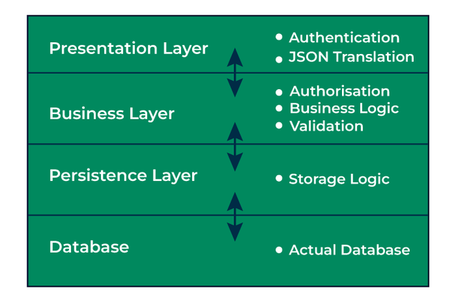
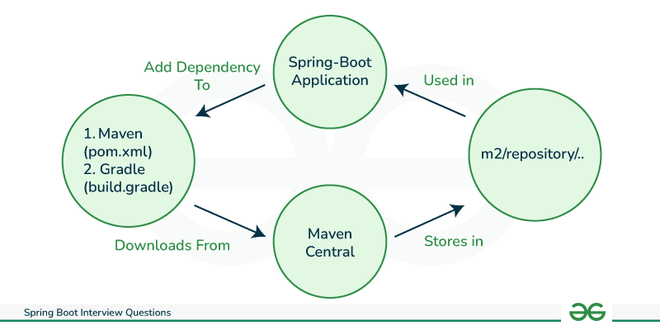
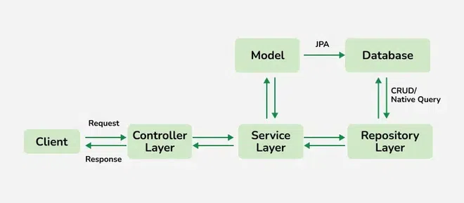
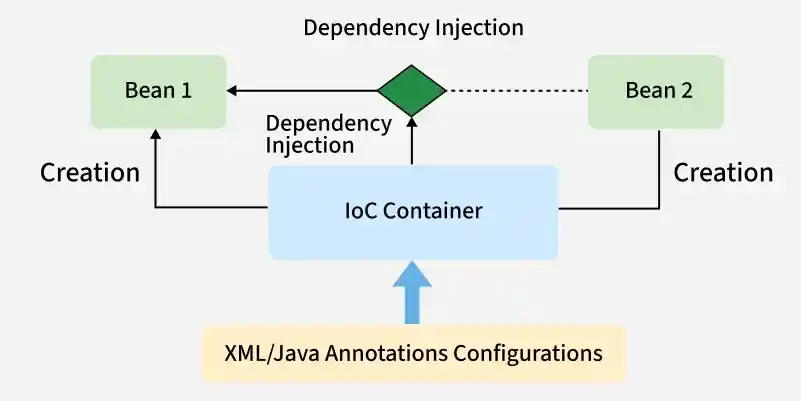

# **Java Interview Questions**

This document serves as a comprehensive guide for Java Spring Boot interview preparation, covering fundamental to advanced topics with structured explanations.

---

# Spring Boot

## Table of Contents

| Sr. No. | Questions                                                                                                                                                |
| ------- | -------------------------------------------------------------------------------------------------------------------------------------------------------- |
| 1       | [What is JVM, JRE, and JDK?](#1-what-is-jvm-jre-and-jdk)                                                                                                 |
| 2       | [What are the main features of Java?](#2-what-are-the-main-features-of-java)                                                                             |
| 3       | [Why is Java not a pure object-oriented language?](#3-why-is-java-not-a-pure-object-oriented-language)                                                   |
| 4       | [What is a classloader and what are its types?](#4-what-is-a-classloader-and-what-are-its-types)                                                         |
| 5       | [What is the difference between an Instance variable and a Local variable?](#5-what-is-the-difference-between-an-instance-variable-and-a-local-variable) |
| 6       | [What are memory allocations available in Java?](#6-what-are-memory-allocations-available-in-java)                                                       |
| 7       | [Why are Java Strings immutable?](#7-why-are-java-strings-immutable)                                                                                     |

### 1. What is Spring Boot?

Spring Boot is built on top of the Spring framework to create stand-alone RESTful web applications with very minimal configuration and there is no need of external servers to run the application because it has embedded servers like Tomcat.

Spring Boot framework is independent.
It creates executable spring applications that are production-grade.

### 2. What are the Features of Spring Boot?

There are many useful features of Spring Boot:

**Auto-configuration** - Spring Boot automatically configures dependencies by using @EnableAutoconfiguration annotation and reduces boilerplate code.

**Spring Boot Starter POM** - These Starter POMs are pre-configured dependencies for functions like database, security, maven configuration etc.

**Spring Boot CLI (Command Line Interface)** - This command line tool is generally for managing dependencies, creating projects and running the applications.

**Actuator** - Spring Boot Actuator provides health check, metrics and monitors the endpoints of the application. It also simplifies the troubleshooting management.

**Embedded Servers** - Spring Boot contains embedded servers like Tomcat and Jetty for quick application run. No need of external servers.

### 3. What are the advantages of using Spring Boot?

Spring Boot is a framework that creates stand-alone, production grade Spring based applications. So, this framework has so many advantages.

1. **Easy to use:** The majority of the boilerplate code required to create a Spring application is reduced by Spring Boot.
2. **Rapid Development:** auto-configuration enable developers to quickly develop apps without the need for time-consuming setup.
3. **Scalable:** Spring Boot apps are intended to be scalable.
4. **Production-ready:** Metrics, health checks, and externalized configuration

### 4. Define the Key Components of Spring Boot.

The key components of Spring Boot are listed below:

- Spring Boot starters
- Auto-configuration
- Spring Boot Actuator
- Spring Boot CLI
- Embedded Servers

### 5. Why do we prefer Spring Boot over Spring?

Here is a table that summarizes why we use Spring Boot over Spring framework.

| Feature              | Spring                | Spring Boot           |
| :------------------- | :-------------------- | :-------------------- |
| Ease of use          | More complex          | Easier                |
| Production readiness | Less production-ready | More production-ready |
| Scalability          | Less scalable         | More scalable         |
| Speed                | Slower                | Faster                |
| Customization        | Less Customizable     | More Customizable     |

### 6. Explain the internal working of Spring Boot.

**Here are the main steps involved in how Spring Boot works:**

- Start by creating a new Spring Boot project.
- Add the necessary dependencies to your project.
- Annotate the application with the appropriate annotations.
- Run the application.

#### 1. Spring boot internal working:

- Spring Boot applications start with SpringApplication.run().
- The IoC Container manages beans and dependency injection.
- Auto-configuration and component scanning reduce manual configuration.

#### 2. Spring Boot Layered Architecture

Spring Boot follows a layered architecture in which each layer communicates with the other layer directly in a hierarchical structure.



#### 3. Explanation:

1. Client makes an HTTP request(GET, POST, PUT, DELETE) to the browser.
   Then the request will go to the controller where all the requests will be mapped and handled.
2. After mapping done, in Service layer all the business logic will be performed. It performs the logic on the data that is mapped to JPA(Java Persistence API) using model classes.
3. In repository layer, all the CRUD operations is done for the rest APIs.
   A JSP page is returned to the user if no errors are there.

#### 4. How Spring Boot Application Starts?

Spring Boot applications start with a main class containing the main() method and the @SpringBootApplication annotation.

- JVM executes the main() method.
- SpringApplication.run() is invoked.
- Spring creates the Application Context.
- Component scanning identifies beans and components.
- Auto-configuration configures required dependencies.
- Beans are created and stored inside the IoC Container.
- Embedded server (Tomcat, Jetty, etc.) starts.
- Application becomes ready to handle requests.

#### 5. Basic Annotations to Start a Spring Boot Application

Spring Boot Application is the class which contains @SpringBootApplication annotation along with the main method. The main method should contain SpringApplication.run method.

```java
import org.springframework.boot.SpringApplication

@SprinBootApplication
 public class GFG {
    public static void main (String[] args) {
        SpringApplication.run(GFG.class, args);
         // Data
    }
}
```

> @SpringBootApplication = @Configuration + @EnableAutoConfiguration + @ComponentScan

#### 6. @Configuration Annotation

- This annotation configures the application context such as transaction, resource handler, view resolver, security etc.
- It is used in class level and it specifically indicates that a class declare one or more than one @Bean methods.

```java
// Annotation
@Configuration
public class GFG {
    @Bean(name = gfg)
      public demoClass demo(){
        // Data
    }
}
```

@EnableAutoConfiguration Annotation:

- This annotation will automatically configures our application we don't need to configure manually.
- It enables the auto-configuration feature of Spring Boot.

```java
// Annotaion
import org.springframework.boot.SpringApplication;
import org.springframework.boot.autoconfigure.EnableAutoConfiguration;

// Annotaion used
@EnableAutoConfiguration
public class GFG {
    public static void main (String[] args) {
        SpringApplication(&quot;GFG.class, args&quot;);
         // Data
    }
}
```

> Here we have used @EnableAutoConfiguration annotation along with the class name to perform the automatic configuration over an application.

#### 7. @ComponentScan Annotation:

- This annotation will automatically scans all the beans and package declaration when the application initializes inside the class path.
- It will automatically scan all the components added to our project.

```java
// @ComponentScan Annotation
@ComponentScan(&quot;com.geeksforgeeks.springboot&quot;)
@SpringBootApplication
public class GFG {
      // Data
}
```

> Automatically discovers components annotated with @Component, @Service, @Repository, or @RestController within its package tree.

### 7. What are the Spring Boot Starter Dependencies?

Spring Boot provides many starter dependencies. Some of them which are used the most in the Spring Boot application are listed below:

- Data JPA starter
- Web starter
- Security starter
- Test Starter
- Thymeleaf starter

### 8. What are the basic Spring Boot Annotations?

#### 1. Common Spring boot annotations:

- **@SpringBootApplication:** This is the main annotation used to bootstrap a Spring Boot application. It combines three annotations: @Configuration , @EnableAutoConfiguration , and @ComponentScan . It is typically placed on the main class of the application.
- **@Configuration:** This annotation is used to indicate that a class contains configuration methods for the application context. It is typically used in combination with @Bean annotations to define beans and their dependencies.
- **@Component:** This annotation is the most generic annotation for any Spring-managed component. It is used to mark a class as a Spring bean that will be managed by the Spring container.
- **@RestController:** This annotation is used to define a RESTful web service controller. It is a specialized version of the @Controller annotation that includes the @ResponseBody annotation by default.
- **@RequestMapping:** This annotation is used to map HTTP requests to a specific method in a controller. It can be applied at the class level to define a base URL for all methods in the class, or at the method level to specify a specific URL mapping.
- **@Bean:** Used to define a Spring bean explicitly inside a configuration class. Gives full control over bean creation and lifecycle.

  ```java
  @Configuration
  public class AppConfig {
  @Bean
  public RestTemplate restTemplate() {
  return new RestTemplate();
  }
  }
  ```

#### 2. Dependency Injection Annotations

@Autowired: Automatically injects required dependencies into a class. Eliminates the need for manual object creation.

```java
@Autowired
private UserService userService;
```

@Qualifier
Specifies which bean to inject when multiple beans of the same type exist.

```java
@Autowired
@Qualifier("emailService")
private NotificationService service;
```

@Primary
Marks a bean as the default choice among multiple candidates. Used when no @Qualifier is explicitly specified.

```java
@Primary
@Component
public class SmsService implements NotificationService {
}
```

#### 3. Web and REST API Annotations

@RestController
Used to create RESTful web services and automatically returns data in JSON or XML format.

```java
@RestController
public class HelloController {
}
```

@RequestMapping
Maps HTTP requests to controller classes or methods. Defines the base URL path for request handling.

```java
@RequestMapping("/api")
public class ApiController {
}
```

#### 4. HTTP Method Annotations

| Annotation     | HTTP Method | Explanation                    |
| :------------- | :---------- | :----------------------------- |
| @GetMapping    | GET         | Retrieves data from the server |
| @PostMapping   | POST        | Sends data to the server       |
| @PutMapping    | PUT         | Updates existing data          |
| @DeleteMapping | DELETE      | Deletes data                   |

**Example:**

```java
@GetMapping("/users")
public List<User> getUsers() {
return userService.getAllUsers();
}
```

@PathVariable
Extracts values from the URI path and binds them to method parameters.

```java
@GetMapping("/users/{id}")
public User getUser(@PathVariable int id) {
return userService.getUser(id);
}
```

@RequestParam
Reads query parameters from the request URL. Used for optional or filtering inputs.

```java
@GetMapping("/search")
public String search(@RequestParam String keyword) {
return keyword;
}
```

@RequestBody
Binds the HTTP request body to a Java object. Commonly used with POST and PUT requests.

```java
@PostMapping("/users")
public User saveUser(@RequestBody User user) {
return userService.save(user);
}
```

#### 5. Configuration and Properties Annotations

@Value
Injects individual property values from application.properties or application.yml.

```java
@Value("${server.port}")
private String port;
```

@ConfigurationProperties
Binds a group of related configuration properties to a POJO in a type-safe manner.

```java
@ConfigurationProperties(prefix = "app")
public class AppConfig {
private String name;
}
```

#### 6. Validation Annotations

Validation annotations ensure input data correctness.

- @NotNull - Field value must not be null
- @NotBlank - String must contain at least one non-whitespace character
- @Email - Validates email format
- @Size - Restricts field length or size.

  ```java
  public class User {
  @NotBlank
  private String username;
  @Email
  private String email;
  }
  ```

#### 7. Exception Handling Annotations

@ExceptionHandler
Handles specific exceptions within a controller. Allows custom error responses for exceptions.

```java
@ExceptionHandler(Exception.class)
public String handleException() {
return "Error occurred";
}
```

@ControllerAdvice
Provides global exception handling across all controllers. Centralizes error-handling logic.

```java
@ControllerAdvice
public class GlobalExceptionHandler {
}
```

#### 8. JPA and Database Annotations

| Annotation      | Purpose                           |
| :-------------- | :-------------------------------- |
| @Entity         | Marks a class as a JPA entity     |
| @Table          | Specifies table mapping           |
| @Id             | Defines primary key               |
| @GeneratedValue | Auto-generates primary key values |
| @Column         | Maps class field to table column  |

### 9. What is Spring Boot dependency management?

Spring Boot dependency management makes it easier to manage dependencies in a Spring Boot project. It makes sure that all necessary dependencies are appropriate for the current Spring Boot version and are compatible with it.

> To create a web application, we can add the S pring Boot starter web dependency to our application.

#### **Life cycle of dependency management:**


Spring Boot Dependency Management is a feature that simplifies the process of managing project dependencies and their versions. Instead of manually specifying compatible versions for every library, Spring Boot provides predefined dependency configurations through its starter packages and dependency management mechanism.

- Manages all project dependencies from a central location.
- Automatically handles compatible dependency versions.
- Reduces version conflicts between libraries.

#### **Working of Dependency Management in Spring-Boot**

- Dependency is nothing but a 'Library' that provides specific functionality that we can use in our application.
- In Spring-Boot, Dependency Management and Auto-Configuration work simultaneously.
- It is the auto-configuration that makes managing dependencies supremely easy for us.
- We have to add the dependencies in the pom.xml/build.gradle file.
- These added dependencies will then get downloaded from Maven Central.
- The downloaded dependencies will get stored into the '.m2' folder in the local file system.
- The Spring-Boot application can access these dependencies from '.m2' and its sub-directories.
- Example -( .m2 -> repository -> org, etc )

#### **Project Build Systems**

- Spring Boot supports two main build system Maven and Gradle.
- **Maven:** Dependencies are managed in the pom.xml file.
- **Gradle:** Dependencies are managed in the build.gradle file.
- Maven and Gradle use a different syntax for managing dependencies.
- Also, we don't need to mention the version of the dependencies, as Spring-Boot configures them automatically. Though we can mention the version or override as well.
- The curated list published contains all the Spring Modules and third-party libraries that you can use with Spring-Boot.

#### **Spring-Boot Starters**

Spring Boot Starters are a set of convenient dependency descriptors provided by Spring Boot that simplify the setup of your application by grouping commonly used libraries and configurations into a single, reusable module.

> Example: 'spring-boot-starter-jdbc'

#### **Types of Starters**

1. Application Starters
2. Technical Starters
3. Production-Ready Starters

#### **Adding Dependencies in Spring Boot**

1. Using Maven (pom.xml)
2. Using Gradle - 'spring-boot-gradle-plugin'

## 10. Is it possible to change the port of the embedded Tomcat server in Spring Boot?

The default port of Spring boot Tomcat embedded server is : 8080
Yes, it is possible to change the port of the embedded Tomcat server in a Spring Boot application.

> server.port=8081

## 11. What is the starter dependency of the Spring boot module?

Spring Boot Starters are a collection of pre-configured maven dependencies that makes it easier to develop particular types of applications. These starters include,

- Dependencies
- Version control
- Configuration needed to make certain features.

To use a Spring Boot starter dependency , we simply need to add it to our project's pom.xml file. For example, to add the Spring Boot starter web dependency, add the following dependency to the pom.xml file:

```xml
<dependency>
      <groupId>org.springframework.boot</groupId>
      <artifactId>spring-boot-starter-web</artifactId>
</dependency>
```

## 12. How to disable a specific auto-configuration class?

To disable a specific auto-configuration class in a Spring Boot application, we can use the @EnableAutoConfiguration annotation with the " exclude" attribute.

> @EnableAutoConfiguration(exclude = {//classname})

## 13. Describe the flow of HTTPS requests through the Spring Boot application.

The flow of HTTPS requests through a Spring Boot application is as follows:



- First client makes an HTTP request ( GET, POST, PUT, DELETE ) to the browser.
- After that the request will go to the controller, where all the requests will be mapped and handled.
- After this in Service layer, all the **business logic** will be performed. It performs the business logic on the data that is mapped to **JPA (Java Persistence API)** using model classes.
- In repository layer, all the **CRUD** operations are being done for the REST APIs .
- A JSP page is returned to the end users if no errors are there.

## 14. Explain @RestController annotation in Spring Boot.

**@RestController** annotation is like a shortcut to building RESTful services. It combines two annotations:

**@Controller :** Marks the class as a request handler in the Spring MVC framework.
@ResponseBody : Tells Spring to convert method return values (objects, data) directly into HTTP responses instead of rendering views.
It enables us to Define endpoints for different HTTP methods **(GET, POST, PUT, DELETE)**, return data in various formats (JSON, XML, etc.) and map the request parameters to method arguments.

### Controller vs RestController

| Features                         | @Controller                                                             | @RestController                                                 |
| :------------------------------- | :---------------------------------------------------------------------- | :-------------------------------------------------------------- |
| **Usage**                        | It marks a class as a controller class.                                 | It combines two annotations i.e. @Controller and @ResponseBody. |
| **Application**                  | Used for Web applications.                                              | Used for RESTful APIs.                                          |
| **Request handling and Mapping** | Used with @RequestMapping annotation to map HTTP requests with methods. | Used to handle requests like GET, PUT, POST, and DELETE.        |

> Note: Both annotations handle requests, but @RestController prioritizes data responses for building API.

### RequestMapping vs GetMapping

| Features        | @RequestMapping                                                 | @GetMapping                             |
| :-------------- | :-------------------------------------------------------------- | :-------------------------------------- |
| **Annotations** | @RequestMapping                                                 | @GetMapping                             |
| **Purpose**     | Handles various types of HTTP requests (GET, POST, etc.)        | Specifically handles HTTP GET requests. |
| **Example**     | @RequestMapping(value = "/example", method = RequestMethod.GET) | @GetMapping("/example")                 |

## 15. What are Profiles in Spring?

**Spring Profiles** are like different scenarios for the application depending on the environment.

- You define sets of configurations (like database URLs) for different situations (development, testing, production).
- Use the @Profile annotation to clarify which config belongs to where.
- Activate profiles with environment variables or command-line options.

To use Spring Profiles, we simply need to define the spring.profiles.active property to specify which profile we want to use.

## 16. What is Spring Boot Actuator?

Spring Boot Actuator is a component of the Spring Boot framework that provides production-ready operational monitoring and management capabilities. We can manage and monitor your Spring Boot application while it is running.

> Note: To use Spring Boot Actuator, we simply need to add the spring-boot-starter-actuator dependency to our project.

```xml
<dependencies>
    <dependency>
        <groupId>org.springframework.boot</groupId>
        <artifactId>spring-boot-starter-actuator</artifactId>
    </dependency>
</dependencies>
```

#### Configuring Actuator in application.properties

Actuator provides several configuration options to customize its behavior. Below are some common configurations:

- We can also change the default endpoint by adding the following in the application.properties file.
  > management.endpoints.web.base-path=/details
- Including IDs/Endpoints
  By default, all IDs are set to false except for 'health'. To include an ID, use the following property in the application.properties file.

      > Example -> management.endpoint.metrics.enabled=true

- List down all IDs that we want to include which are separated by a comma.
  > management.endpoints.web.exposure.include=metrics,info
- Include only metrics and info IDs and will exclude all others ('health' too).
  > management.endpoints.web.exposure.include=\*
- Excluding IDs/Endpoints

  > Example -> management.endpoints.web.exposure.exclude=info

  #### /actuator endpoint

  It's simple just hit the default endpoint '/actuator', ensure that your Application is running.

  #### /actuator/health

  We can click on these above links and see the respective information. Additionally, we can activate other Actuator IDs and use them after '/actuator' to see more information. For example, 'health' ID is activated by default. Therefore we can click the link in the image or directly use 'http://localhost:8080/actuator/health'.

## 17. What is dependency Injection and its types?

Dependency Injection (DI) is a design pattern that enables us to produce loosely coupled components. In DI, an object's ability to complete a task depends on another object. There three types of dependency Injections.

- Constructor injection: This is the most common type of DI in Spring Boot. In constructor injection, the dependency object is injected into the dependent object's constructor.
- Setter injection: In setter injection, the dependency object is injected into the dependent object's setter method.
- Field injection : In field injection, the dependency object is injected into the dependent object's field.

Spring Dependency Injection (DI) is a fundamental concept in the Spring Framework that allows objects to receive their dependencies from an external source rather than creating them internally.

- Eliminates the need for classes to create their own dependencies
- Makes code more reusable and modular
- Supports constructor, setter, and field injection
- Works with XML configuration, annotations, or Java-based configuration.


In above Diagram:

- The IoC (Inversion of Control) Container is responsible for creating and managing objects (called Beans).
- Bean 1 and Bean 2 are created by the container instead of being manually instantiated.
- If Bean 1 depends on Bean 2, the container automatically injects Bean 2 into Bean 1 (this is Dependency Injection).
- The configuration for this process is defined using XML or Java Annotations.

#### 1. Setter Dependency Injection:

Setter DI involves injecting dependencies via setter methods. To configure SDI, the @Autowiredannotation is used along with setter methods and the property is set through the `property` tag in the bean configuration file.

```java
package com.geeksforgeeks.org;

import com.geeksforgeeks.org.IGeek;
import org.springframework.beans.factory.annotation.Autowired;

public class GFG {

    // The object of the interface IGeek
    private IGeek geek;

    // Setter method for property geek with @Autowired annotation
    @Autowired
    public void setGeek(IGeek geek) {
        this.geek = geek;
    }
}
```

Bean configuration:

```xml
<beans
xmlns="http://www.springframework.org/schema/beans"
xmlns:xsi="https://www.w3.org/2001/XMLSchema-instance"
xsi:schemaLocation="
          http://www.springframework.org/schema/beans
          http://www.springframework.org/schema/beans/spring-beans-2.5.xsd">

    <bean id="GFG" class="com.geeksforgeeks.org.GFG">
        <property name="geek"  ref ="CsvGFG" />
    </bean>

<bean id="CsvGFG" class="com.geeksforgeeks.org.impl.CsvGFG" />
<bean id="JsonGFG" class="com.geeksforgeeks.org.impl.JsonGFG" />

</beans>
```

#### 2. Constructor Dependency Injection (CDI):

Constructor DI involves injecting dependencies through constructors. To configure CDI, the `<constructor-arg>` tag is used in the bean configuration file.

```java
package com.geeksforgeeks.org;

import com.geeksforgeeks.org.IGeek;

public class GFG {

    // The object of the interface IGeek
    private IGeek geek;

    // Constructor to set the CDI
    public GFG(IGeek geek) {
        this.geek = geek;
    }
}
```

| Setter DI                                                                    | Constructor DI                                                                   |
| :--------------------------------------------------------------------------- | :------------------------------------------------------------------------------- |
| Creates mutable objects. Dependencies can be modified after creation.        | Creates immutable objects. Dependencies can't be modified after creation.        |
| Dependencies can be injected later.                                          | All dependencies must be provided at creation.                                   |
| Requires addition of @Autowired annotation.                                  | @Autowired annotation is not needed.                                             |
| It results in circular dependencies or partial dependencies.                 | It too can have circular dependencies, it just fails faster and more explicitly. |
| Requires framework or manual setter calls for dependency injection in tests. | Easier unit testing - can create objects directly with mock dependencies.        |

## 18. What is an IOC container?

An IoC (Inversion of Control) Container in Spring Boot is essentially a central manager for the application objects that controls the creation, configuration, and management of dependency injection of objects (often referred to as beans), also referred to as a DI (Dependency Injection) container.

The Spring Inversion of Control (IoC) container is a core component of the Spring Framework, streamlining object creation and management. It promotes flexibility and maintainability by managing dependencies and configurations automatically, allowing developers to concentrate on core business logic.

- Configuration Metadata: Defines how beans should be created, configured, and wired.
- Bean Instantiation: The container creates instances of beans as per the configuration.
- Dependency Injection: Automatically resolves and injects the necessary dependencies into beans.
- Lifecycle Management: Manages bean initialization, destruction, and scope (singleton, prototype, etc.).

The following diagram illustrates how the IoC container manages the creation of beans and injects their dependencies in a Spring application.



#### **Types of Spring Containers**

#### 1. BeanFactory Container

    The BeanFactory is the simplest and most lightweight container in Spring. It provides basic features for bean creation and management but lacks advanced functionalities such as event handling and AOP.

    - Suitable for simple applications with minimal configuration.
    - Beans are created lazily, meaning they are instantiated only when requested.
    - Typically used for low-memory or resource-constrained environments.

```java
import org.springframework.beans.factory.BeanFactory;
import org.springframework.beans.factory.xml.XmlBeanFactory;
import org.springframework.core.io.ClassPathResource;

public class BeanFactoryExample {
    public static void main(String[] args) {
        // Load the Spring context (XML configuration)
        BeanFactory factory = new XmlBeanFactory(new ClassPathResource("beans.xml"));

        // Access the bean from the factory
        MyBean myBean = (MyBean) factory.getBean("myBean");

        // Use the bean
        myBean.doSomething();
    }
}
```

> BeanFactory Container does not support annotation-based configuration

#### 2. ApplicationContext Container

The ApplicationContext is a more advanced and feature-rich container compared to BeanFactory. It extends BeanFactory and adds additional features such as event propagation, AOP support, and internationalization.

More commonly used in production applications.
In the ApplicationContext container, by default, beans are created eagerly during the container initialization process.
It provides additional services like message resources, event handling, and more.

**Syntax for ApplicationContext Ioc Container**

1. Using XML Configuration

```java
import org.springframework.context.ApplicationContext;
import org.springframework.context.support.ClassPathXmlApplicationContext;

public class ApplicationContextExample {
    public static void main(String[] args) {
        // Load the Spring context (XML configuration)
        ApplicationContext context = new ClassPathXmlApplicationContext("beans.xml");

        // Access the bean from the application context
        MyBean myBean = (MyBean) context.getBean("myBean");

        // Use the bean
        myBean.doSomething();
    }
}
```

2. Using AnnotationBasedConfiguration

```java
import org.springframework.context.annotation.AnnotationConfigApplicationContext;

public class AnnotationContextExample {
    public static void main(String[] args) {
        // Load the Spring context using annotations
        AnnotationConfigApplicationContext context = new AnnotationConfigApplicationContext(AppConfig.class);

        // Access the bean from the application context
        MyBean myBean = context.getBean(MyBean.class);

        // Use the bean
        myBean.doSomething();
    }
}
```

## 15. How is Hibernate chosen as the default implementation for JPA without any configuration?

Spring Boot automatically configures Hibernate as the default JPA implementation when we add the spring-boot-starter-data-jpa dependency to our project. This dependency includes the Hibernate JAR file as well as the Spring Boot auto-configuration for JPA.
